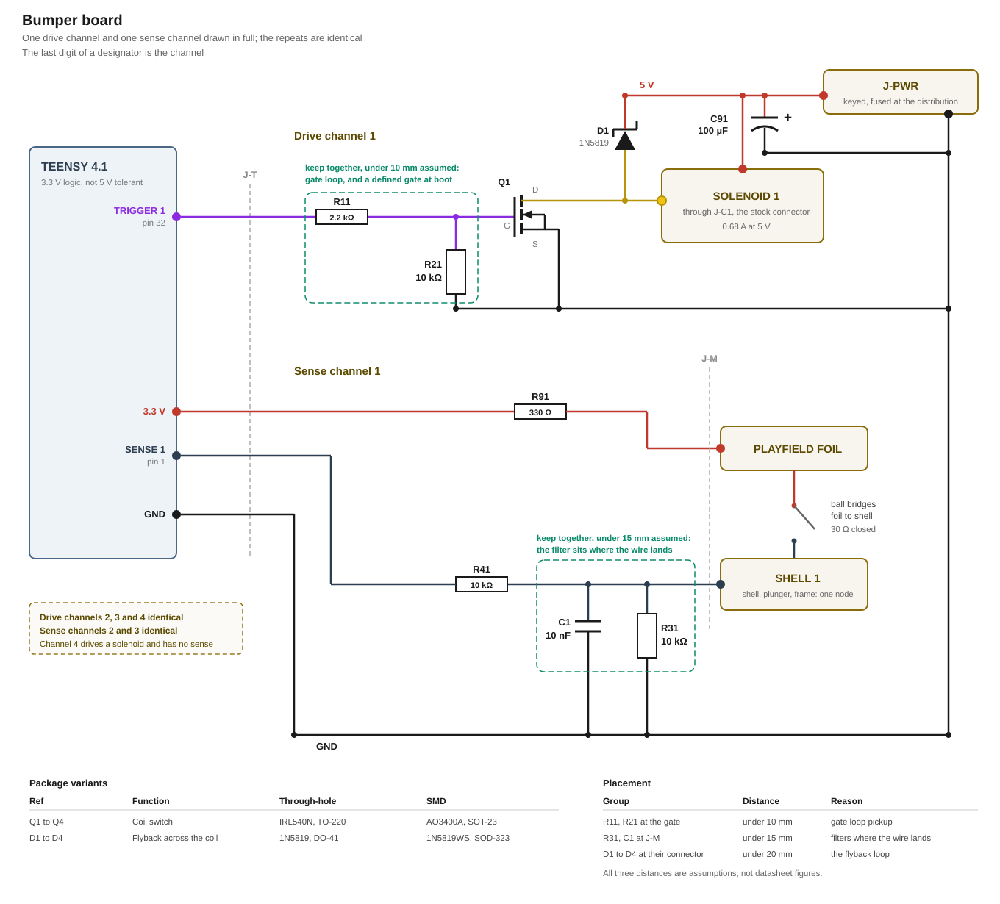

# Bumpers

This modification requires four solenoid channels. Three drive the top bumpers taken from the stock machine, and the fourth drives a [scoop](https://missionpinball.org/latest/mechs/scoops/), an [Adafruit 3992](https://www.adafruit.com/product/3992) push-pull solenoid.

Driving the top bumpers follows the same principle as the stock machine, which is described in [`3_bumper-control.md`](../../research/Rokr/3_bumper-control.md).

A bumper fires when a ball closes a circuit between the conductive foil on the playfield and the metal shell of the bumper itself. The firmware then energises the solenoid for a short moment and releases it.

A single board drives all four. Below the schematic of the solenoid board. The last digit of a component is the channel it belongs to. Q1, D1, R11 and R21 make up drive channel 1, and R31, R41 and C1 make up sense channel 1.



## Requirements

- The driver triggers a top bumper, not the game logic.
- The game logic can fire a single solenoid itself.
- A pull lasts long enough to kick the ball away, and short enough that a ball can be fired back and forth between the three top bumpers.
- The solenoids are guarded against being held in. Their vendor and their specifications are unknown, so none is ever energised for longer than five seconds.

## Drive

Each channel switches its coil on the low side with an N-channel MOSFET. The gate hangs on a Teensy pin through a series resistor that bounds what the pin drives at the switching moment. A pull-down resistor pulls the gate to ground whenever the Teensy does not drive the pin, and the coil is then off. This holds while the Teensy is unpowered and after a reset. After a reset, a weak circuit inside the Teensy pin, its keeper, still tries to hold the pin at its last level. The pull-down is strong enough to win against it, so a coil that was on at the reset turns off. A Schottky diode across the coil takes the winding current at switch-off, which holds the drain of the MOSFET a diode drop above the rail. For each solenoid the drive channels are built identical.

## Sense

The foil is one sheet on the playfield, fed from 3.3 V through R91. That resistor protect unlikely short circuits if anything other than the designed sense channels grounds the foil.


Each solenoid shell reaches the board on a separate wire. A pull-down holds that wire at ground until a ball bridges foil and shell and pulls it up to the rail. A capacitor at the terminal filters what the playfield wire brings in, and a series resistor carries it on to the Teensy pin. A fault that ties a sense wire to a coil wire puts 5 V on that node. R41 to R43 are 10 kΩ, sized for the worst case (the Teensy unpowered) to keep the resulting current under the 1 mA PJRC calls very unlikely to cause harm.

## Supply

The four coils draw from the central 5 V power distribution, brought in at J-PWR. The three sense channels are driven directly from the Teensy, since their current draw is next to nothing. That keeps every sense net dead whenever the Teensy is dead. The two supply rails are not wired to each other on this board.

The board has two ground nets. The sense channels sit on the signal ground, which reaches the Teensy over J-T. The MOSFETs, the flyback diodes, the gate pull-downs and C91 sit on the power ground, which reaches the distribution over J-PWR. In normal operation, the two grounds are not wired to each other on this board.

> On the bench, with the Teensy on USB, the two GND nets must be bridged on the board.

**C91, 100 µF at J-PWR**, absorbs the feed cable's own inductive kick when a coil switches off, keeping it off the board's copper.

Rail sag, shorts and overcurrent are not handled on this board, but centrally on the power supply board.

## Board

### Connectors

One board sits near the three bumpers and carries all four drive channels and all three sense channels.

| Connector | Poles | To |
|---|---|---|
| **J-PWR** | 2 | 5 V and GND from the power distribution, keyed |
| **J-T** | 9 | The Teensy |
| **J-C1** to **J-C4** | 2 each | 5 V and the MOSFET's drain to the solenoids |
| **J-M** | 4 | Open wires with eyelets. One 3V for the foil and the three eyelets unpowered to the solenoid shells. |

| J-T pin | Signal | Direction |
|---|---|---|
| 1 | Trigger 1 | Teensy to the board |
| 2 | Trigger 2 | Teensy to the board |
| 3 | Trigger 3 | Teensy to the board |
| 4 | Trigger 4 | Teensy to the board |
| 5 | Sense 1 | board to the Teensy |
| 6 | Sense 2 | board to the Teensy |
| 7 | Sense 3 | board to the Teensy |
| 8 | 3V3 | the Teensy's rail, feeding the foil through R91 |
| 9 | GND | the Teensy's ground, beside the signals |

> Before the Teensy is plugged in for the first time, every J-T pin should be measured against J-PWR's GND with J-PWR powered and J-T open. All values must read 0 V. Anything else means the 5 V side has reached the connector and would kill an unpowered Teensy.

### Layout

The coil wiring and the sense wiring should be routed with distance from each other in order to prevent the sense channels from being influenced by solenoids pulling. The signal ground net and the power ground net are separated.

The following parts should be placed close to each other forming a group:

| Group | Why |
|---|---|
| R11 and R21 at the gate of Q1 | A long loop here lets switching noise couple into the gate, which R21 might not hold down fast enough |
| R31 and C1 at the screw terminal | Placed further away, the wire between the terminal and the filter would carry the signal unfiltered, and pick up more noise on the way |
| D1 at J-C1 | A long loop here adds inductance to the flyback path itself, raising the voltage spike at switch-off |

## Teensy pins

| Signal | What the pin has to be |
|---|---|
| Four triggers | A plain digital output. A pull-in is a level held for a measured time, so none of them needs PWM |
| Three senses | A plain digital input that can interrupt on both edges |

Which pins carry them, and what each one costs elsewhere in the build, is in [`pin-assignment.md`](../../pin-assignment.md).

## Firmware

The driver is responsible for sensing and firing solenoids. It also ensures that solenoids can not be permamently pulled and thus protected from overheat and damage. 

Controlling the hardware is handled by interrupt handlers. The top bumpers are triggered automatically upon sense. The scoop solenoid is controlled by the game logic.

[`firmware/bumper.md`](../../../firmware/bumper.md) describes the driver.

## Part list

| Qty | Part | Through-hole | SMD | Where |
|---|---|---|---|---|
| 4 | Logic-level MOSFET, N-channel | IRL540N, TO-220 | AO3400A, SOT-23 | **Q1** to **Q4**, coil switches |
| 4 | Schottky diode | 1N5819, DO-41 | 1N5819WS, SOD-323 | **D1** to **D4**, across each coil |
| 10 | 10 kΩ resistor | | | **R21** to **R24** gate pull-down, **R31** to **R33** sense pull-down, **R41** to **R43** sense series |
| 4 | 1.1 kΩ resistor | | | **R11** to **R14**, gate |
| 3 | 10 nF capacitor | | | **C1** to **C3**, sense filter |
| 1 | 330 Ω resistor | | | **R91**, foil feed |
| 1 | 100 µF electrolytic, 10 V or more | | | **C91**, bulk at J-PWR |
| 4 | 2-pin connector, mating the stock coil connector | | | **J-C1** to **J-C4** |
| 1 | 4-way screw terminal | | | **J-M**, foil and three shells |
| 1 | 2-pin connector that cannot be plugged in reversed | | | **J-PWR** |
| 1 | 9-pin connector that cannot be plugged in reversed | | | **J-T** |

## Appendix: derivations

Every figure below is recomputed by [`figures.py`](figures.py) from the inputs it names, and `tools/figcheck.py` compares each one against the line that states it. The drawn figures carry a `data-fig` anchor and are checked the same way.

**The drive channel.** What the Teensy pin sees, what the gate sees, and what the drain sees.

```
V_GATE    the Teensy's rail                       3.3 V
          R_gate to ground                        10 kΩ
          the rail across R_gate and that one,
          which is the gate while it is on      = 2.97 V
          the gate threshold, worst case          1.45 V
          the gate voltage R_DS(on) is specified
          at, which the gate has to clear          2.5 V
          what the gate clears it by, with no coil
          current in the grounds                = 473 mV
          the gate-source rating                  12 V
          after a reset the pin's keeper holds the
          level the pin last drove, at its
          strongest through                       105 kΩ
          the gate while it holds a high        = 0.29 V
          the pin then                          = 0.32 V
          the input's low level, 0.3 × the rail = 0.99 V
I_PIN     R_gate                                  1.1 kΩ
          the rail across it, at the switching
          moment                                = 3.0 mA
          the rail across both resistors, held  = 297 µA
          what PJRC allows on one pin             4 mA
          R_gate × 630 pF, the gate settling    = 0.69 µs
V_KICK    a step on the drain lifts the gate through
          the capacitive divider of the part itself,
          taken at the largest step the drain makes,
          which is the clamped switch-off:
          input capacitance                       630 pF
          reverse transfer capacitance            50 pF
          5.55 V × 50 pF / 630 pF               = 0.440 V
          the gate threshold, lowest              0.65 V
          the IRL540N brings its own divider and
          its own threshold to the same step:
          input capacitance                       1800 pF
          reverse transfer capacitance            170 pF
          that step through them                = 0.524 V
          its gate threshold, lowest              1.00 V
          R_gate to ground × 630 pF, over which a
          drain step has to be short for that
          figure to hold                        = 6.30 µs
          which is the case at switch-off and not
          when the rail comes up behind C91
V_DRAIN   the machine's rail, measured            5 V
          the diode's forward drop at 1 A         0.55 V
          the drain at switch-off, clamped      = 5.55 V
          the MOSFET's drain-source rating        30 V
          the diode's reverse rating              40 V
P_Q       R_DS(on) max, at the lowest gate voltage
          the sheet specifies                     48 mΩ
          the scoop's coil, the largest of the
          four and the worst case for a channel    0.8 A
          that current × 48 mΩ, the drop
          across Q                              = 38.4 mV
          that current² × 48 mΩ, while energised = 30.7 mW
          what the package dissipates             1.4 W
I_CH      the coil, measured                      0.68 A
          the scoop's coil                         0.8 A
          the diode's average forward current      1 A
          its surge rating                        25 A
          the MOSFET's continuous drain current   5.7 A
I_FEED    3 stock channels at 0.68 A plus the
          scoop's 0.8 A, the unarbitrated demand
          the protection interrupts             = 2.84 A
```

**The sense channel.** What a closed contact puts on the pin, and how fast the node follows.

```
V_SENSE   the contact from foil to shell,
          measured at its worst point             30 Ω
          R91 in the foil feed, shared            330 Ω
          R_pulldown, one per channel             10 kΩ
          the pin with one ball on a bumper     = 3.19 V
          the pin with all three closed, which
          loads R91 three ways                  = 2.99 V
          the pin with no ball                     0 V
          the input's high level, 0.7 × the rail = 2.31 V
R_S       between the node and the Teensy pin     10 kΩ
          how far a pin may go past its rail
          before its protection diode takes over  0.31 V
          the rail plus that, where a powered
          pin clamps                            = 3.61 V
          5 V through the series resistor into an
          unpowered pin, whose ceiling is that
          0.31 V alone                          = 0.469 mA
          what PJRC calls unlikely to harm        1 mA
I_FOIL    3.3 V through one closed branch       = 0.319 mA
          all three closed together             = 0.898 mA
          what the Teensy's 3V3 pin allows        250 mA
          3.3 V / 330 Ω, the foil held at ground = 10 mA
          the same fault inside R91             = 33 mW
          a foil meeting a coil wire instead,
          into an unpowered 3.3 V rail          = 14.2 mA
          what an 0805 dissipates                 125 mW
T_SENSE   C_filter at the terminal                10 nF
          10 kΩ × 10 nF, the node falling       = 100 µs
          R91 and the contact into the same
          capacitor, the node rising            = 3.6 µs
          the ball                                9 mm
          the fastest ball the build assumes      3 m/s
          9 mm / 3 m/s, how long a contact lasts = 3 ms
          the window in which further edges on
          the same channel are the same hit       10 ms
```

**The supply.** What the bulk capacitor covers, and the stock machine it is measured against.

```
C_BULK    the WS2812B's minimum supply            4.5 V
          how far the rail may sag              = 0.5 V
          C91                                     100 µF
          bought at a working voltage of          10 V
          that charge over the scoop's 0.8 A, the
          worst case, how long one coil is carried
          from the capacitor                    = 62.5 µs
          taking the coil as a current step, which
          its own inductance stretches severalfold
          the feed from the distribution,
          estimated from its length                0.3 µH
          0.8 A across it into C91, the rail
          lifted at switch-off                  = 43.8 mV
          the drain then                        = 5.59 V
          the board's own copper with C91
          unfitted, estimated                      2 nF
          the same charge into that instead     = 9.80 V
          the stock machine's bulk                200 µF
          the three stock coils it carries      = 2.04 A
FAULT     a coil pair shorted in the loom,
          estimated from the conductor             0.2 Ω
          5 V across it and the switch          = 20.2 A
          that current through R_DS(on)         = 19.5 W
          what practice leaves of a per-contact
          rating                                   80 %
GND       one wire of a cable with its two
          contacts, every wire the same,
          estimated                                0.1 Ω
          all four coils at once                   2.84 A
          the power ground over the distribution,
          all of it on J-PWR's ground wire       = 284 mV
          the gate with that rise against it     = 2.71 V
          what it still clears 2.5 V by          = 217 mV
```

**The coil.** What one pull-in costs, what the enforced duty leaves, and how long a coil stays on when the driver tick never releases it.

```
DUTY      5 V × 0.68 A, while energised         = 3.4 W
          the longest pull-in the driver commands  50 ms
          how far past that a coil may run
          before the loop counts it overdue        1 ms
          the longest a pull-in therefore lasts = 51 ms
          the cool-down after a release, before
          the coil may fire again                  10 ms
          that and the pull-in together         = 61 ms
          the first over the second             = 83.6 %
          3.4 W over the same fraction          = 2.84 W
HOLD      the watchdog timeout, after which the
          restart releases a coil still on         2 s
          that and the longest pull-in, how long
          a coil the tick never releases stays on = 2.051 s
          the limit from the requirements          5 s
```

## Sources

- [`research/Rokr/3_bumper-control.md`](../../research/Rokr/3_bumper-control.md): the coil measurements, the contact resistance, the conductive-foil mechanism, the stock trigger circuit and the wiring that leaves the stock board
- [`research/Rokr/1_power-supply.md`](../../research/Rokr/1_power-supply.md): the machine's 5 V rail and the stock load inventory
- [`research/teensy-4.1.md`](../../research/teensy-4.1.md): 3.3 V logic, the per-pin current, the 3.3 V rail available to external circuits, and what reaches an unpowered pin
- [Alpha & Omega Semiconductor AO3400A](../../datasheets/AO3400A-AOS.pdf), Rev 3.1: the ratings, R_DS(on) at V_GS = 2.5 V, the gate threshold and the capacitances
- [International Rectifier IRL540N](../../datasheets/IRL540N.PDF): the through-hole variant's ratings and gate threshold
- [STMicroelectronics 1N5817, 1N5818, 1N5819](../../datasheets/1n5817.pdf), DocID 6262 Rev 5: the 1N5819 column of the ratings and static characteristics tables
- [NXP i.MX RT1060 Crossover Processors for Consumer Products](../../datasheets/IMXRT1060CEC.pdf), Rev. 4: the GPIO high-level input voltage, given as 0.7 × NVCC_XXXX
- [Worldsemi WS2811](../../datasheets/WS2811-Worldsemi.pdf): the supply range whose minimum sets how far the rail may sag
- [Adafruit 3992](https://www.adafruit.com/product/3992) product page: the scoop's solenoid, its current draw at 5 V
- [`pin-assignment.md`](../../pin-assignment.md): which pins were free, and what each one costs
- [`firmware/driver-design.md`](../../../firmware/driver-design.md): that a bumper is sensed and fired inside its interrupt and reports afterwards
