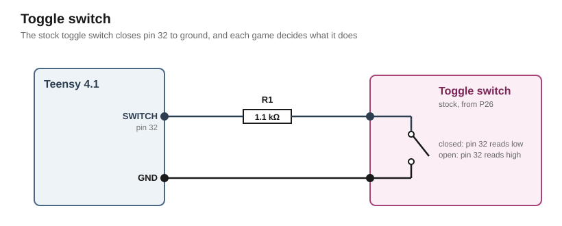

# Controls

Controls are the inputs the player sets by hand.

## Toggle switch

The stock machine's toggle switch (P26) turned its background music off.

In this build it gets connected directly to the Teensy.



A lead with the matching receptacle takes the switch to pin [32](../../pin-assignment.md "Toggle switch"), which the switch closes to ground. The Teensy's internal pull-up holds the pin high while the switch is open.

R1, 1.1 kΩ, sits in series with the pin. It protects coding errors if the firmware ever drives the pin high against the closed switch. R1 limits the current to 3.16 mA.

The switch closes its contact in position 1 and opens it in position 0. 

> [!Warning] 
>TODO: Measure the switch's positions

Each game decides what the switch does. The firmware reports only its position.

## Part list

| Qty | Part | Where |
|---|---|---|
| 1 | stock toggle switch (P26) | its two wires on pin [32](../../pin-assignment.md "Toggle switch") and GND of the Teensy |
| 1 | 1.1 kΩ resistor, 5 % or better | R1, in series between pin [32](../../pin-assignment.md "Toggle switch") and the switch |

## Appendix: derivations

Every figure below is recomputed by [`figures.py`](figures.py) from the inputs it names, and `tools/figcheck.py` compares each one against the line that states it.

### Series resistor

```
I_FAULT   the rail the pin drives high             3.3 V
          R1                                       1.1 kΩ
          its tolerance                            5 %
          R1 at its low end                      = 1.045 kΩ
          the current into the closed switch     = 3.16 mA
          what the pin allows                      4 mA
V_LOW     the pull-up's current with the pin at
          ground, at most                          212 µA
          R1 at its high end                     = 1.155 kΩ
          the pin with the switch closed         = 0.245 V
          the low input level, 0.3 × the rail    = 0.99 V
```

## Sources

- [`datasheets/IMXRT1060CEC.pdf`](../../datasheets/IMXRT1060CEC.pdf): Rev. 4, Table 22, the pull-up's current with the pin at ground and the low input level
- [PJRC, `digital.c`](https://github.com/PaulStoffregen/cores/blob/master/teensy4/digital.c): `INPUT_PULLUP` selects the 22 kΩ pull-up, `IOMUXC_PAD_PUS(3)`
- [`research/teensy-4.1.md`](../../research/teensy-4.1.md): the 4 mA per pin
