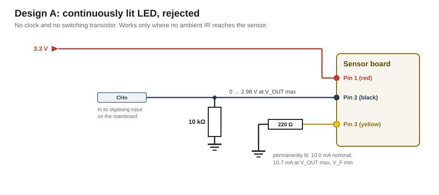
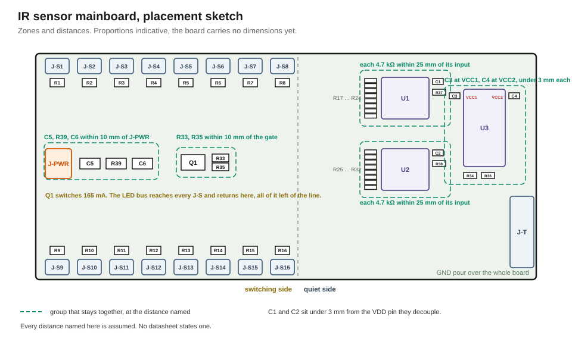

# IR ball sensing
## Requirements

The IR channels are how the game knows where the ball is.

| | |
|---|---|
| **Moving ball** | Report a ball crossing a point on the track, fast enough that a plunger launch is not missed |
| **Resting ball** | Report a ball at rest in a position, a lock or the drain trough, for as long as it stays there |
| **Robustness** | Hold both while environmental light changes during a game |
| **Sensor count** | Up to sixteen positions on one board. Sixteen is the case every figure is derived at, and a smaller count only relaxes it |
| **Isolation** | No conductor drives current into a Teensy pin while the Teensy is unpowered, in any state and in any switching order. |

## TL;DR from the stock machine

The stock board, its measurements and its reconstructed circuit are documented in [`research/Rokr/2_ir-reflective-sensor-p33.md`](../../research/Rokr/2_ir-reflective-sensor-p33.md). Everything below builds on the interface established there:

- Pin 1 supply,
- Pin 2 phototransistor emitter output,
- Pin 3 IR LED cathode

There is no ground pin, and no current limit for the LED on the sensor board.

The stock machine pulses the emitters to keep ambient light out of the reading.

## Design

IR sensors are the main driver of this modification to detect if a ball has passed a point on the playfield or sits stationary at some point.  

### Sensor boards

Three sensor boards come out of the stock machine. This modification keeps these boards, as they are already shaped for their install locations. To avoid designing multiple IR-sensing strategies it is planned that each new sensor board is built as a 1:1 copy of the stock boards.

### Mainboard

It is planned to have a central IR-sensing mainboard which provides the whole electrical infrastructure to interconnect sensor boards to the Teensy microcontroller. The mainboard therefore provides a bank of connectors to the sensor boards, and carries the sensor boards' supply with it.

### Power Supply Design: 5 V vs 3.3 V

Either supply design can carry IR-reflective-based ball sensing. The stock machine supplies these boards from 5 V, and nothing on them technically asks for more than 3.3 V.

This modification chooses a **3.3 V supply design**. Teensy pins are not 5 V tolerant, so a 3.3 V board keeps the whole low-voltage side in one domain. The whole design receives its power from an external 3.3 V source, which is either the Teensy itself or power conversion ([see below](#supply-and-input-filter)).

A 5 V board was evaluated and rejected. It would drop the need for a regulator, but there are two things that count against it:

1. Putting 5 V into the design unnecessarily raises the risk that a Teensy pin sees overvoltage
2. A sensor reading is measured against the supply, so when the supply moves the reading moves with it. A 5 V design takes its supply straight from the machine, where [lighting](../lighting/design.md) and solenoids move it. A separate 3.3 V supply holds the rail steady.

## Design A: Continuously lit LED, rejected

In this design the emitter burns continuously and the level itself is the measurement: a ball is a rise above what the empty track returns. Nothing cancels ambient light out of that reading, so the location has to be dark.

Pin 3 sits permanently at GND through 220 Ω, and Pin 2 reaches the input across a 10 kΩ pull-down to GND. The emitter runs at 9.4 mA nominal and 10.3 mA at V<sub>OUT</sub> max with V<sub>F</sub> min, and the node ceiling is 2.98 V.



The phototransistor cannot tell where the IR came from, so the input carries the sum of the board's own reflection and all ambient IR: daylight, lamps, light bounced off nearby objects.

| Objection | Evidence |
|---|---|
| Ambient movement swamps the signal | In the test build, small movements near the sensor shifted the level by several times what the 9 mm ball produces. A fixed threshold no longer separates ball from disturbance |
| Not calibratable | The baseline moves with time of day, room lighting and playfield surroundings. A threshold calibrated at build time is wrong an hour later, and direct sunlight can saturate the phototransistor outright |
| The stock machine does not do it either | It pulses at 333 Hz and subtracts, [as measured](../../research/Rokr/2_ir-reflective-sensor-p33.md) |

In permanent darkness (tunnel or under playfield) the design works and delivers up to 4× the signal compared to a pulsed channel. However, that gain does not pay for carrying two designs at once, so every channel uses Design B.

## Design B: Pulsing IR measurement

This follows the principle of the stock machine. The emitter is pulsed and every channel is read twice, once lit and once dark. The difference is what the emitter's own light did, so ambient light cancels out of the reading whatever it happens to be doing.

One transistor switches all emitters together, so a single Teensy pin controls the whole bus. Each phototransistor works into its own pull-down and is read independently in both phases.


| Net | Wiring |
|---|---|
| Supply | Pin 1 of every sensor board to the board's 3.3 V |
| Signal, per channel | Pin 2 of each board to an analog input, with a 4.7 kΩ pull-down to GND at the sensor-side node. The pull-down converts the photocurrent into a voltage; without it the output carries no measurable signal |
| LED drive, common | Pin 3 of each board through its own 220 Ω to a shared LED bus. The bus goes to the drain of one switching transistor, source to GND, gate driven through a 2 kΩ from the clock pin, with a 100 kΩ pull-down to GND at the gate |
| Ground | No ground line runs to the sensor boards. The returns are Pin 2 through its pull-down and Pin 3 through its 220 Ω and the transistor |

Every value here is derived in [the appendix](#appendix-derivations).

Everything here is per channel and holds at any channel count. What the bus and the supply add up to depends on how many channels are populated, and is in [supply](#supply-and-input-filter).

## Adjustment knobs

What a channel delivers is one number: the LED-on reading minus the LED-off reading. Without a ball it is small, a ball passing makes it jump up, and the firmware compares that jump against a threshold calibrated per channel. Channels may therefore carry different resistor values, and a swap on one moves only that channel's reading.

| Issue | Reason | Change |
|---|---|---|
| One channel catches the ball sometimes and misses it sometimes, while its neighbours are reliable. The jump is there, but too small to threshold against | Too little IR comes back: that sensor sits further from the ball, at a worse angle, or over a duller patch | Make its emitter brighter: that channel's **220 Ω → 150 Ω**, raising it from 9.3 to about 13.4 mA nominal, 14.9 mA worst case |
| One channel sits near the top of its range all the time, ball or no ball, so a ball cannot push it any higher. It either never reports one or reports one permanently | Ambient IR alone already drives the phototransistor to its limit, leaving no headroom for the reflection | Make it less sensitive: that channel's **4.7 kΩ → 2.2 kΩ**, or 1.5 kΩ where that is still short. The same photocurrent then produces less voltage, so the range opens up again |

### Limits

A swap has to pass two checks.

**1. For the channel itself**:

| Resistor | Range | Set by |
|---|---|---|
| Emitter | <u>47 Ω</u> … 434 Ω | **Below:** the emitter burns out, past its 50 mA I<sub>F</sub> absolute maximum at V<sub>OUT</sub> max and V<sub>F</sub> min. Under 82 Ω that channel's emitter resistor passes half its own rated power and has to move to a larger case. **Above:** the emitter drops below the 4 mA the detector is characterised at, and the datasheet stops saying what comes back |
| Pull-down | 1 kΩ … 5 kΩ | **Below:** the gap between a ball and a clear track shrinks into the noise, 50 µA giving about 15 steps of a ten-bit read at 1 kΩ. **Above:** the converter cannot read a source this large in the time it has and mixes one channel into the next; and the same room light makes more voltage, until it alone fills the range a ball would need |

*The <u>underlined</u> bound destroys hardware when crossed; the others stop the channel from working and damage nothing.*

**2. For the whole board**:
```
Σ (2269 mV / R_emitter)  +  Σ (3449 mV / (1585 Ω + R_pull-down))  +  I_fixed  MUST BE ≤  I_supply

where  I_supply = 250 mA and I_fixed = 18.6 mA  fed from the Teensy's 3V3 pin
       I_supply = 500 mA and I_fixed =  8.3 mA  fed from the module

Both have to pass.
```

## Pin allocation

Which pins this subsystem takes, and what each one locks out, is in [`pin-assignment.md`](../../pin-assignment.md). What constrained the choice:

- **SPI is a bus.** SCK, MOSI and MISO are shared with whatever else arrives later, and each device adds only its own chip select.
- **Two chip selects need no special function, the clock line takes a PWM channel** so the emitter pulse leaves the timer's compare logic rather than an interrupt. None of the three is analog-capable, so the analog inputs stay free.

## Software

### Design

The IR sensing is delivered as a library. The library exposes a public-facing API for initialization and reporting. The library also acts a the driver and owns things such as IR pulsing, timing constraints, and calibration and evaluation logic.

The library publishes events. Two event kinds, one level query and initialisation are the whole interface.

| | |
|---|---|
| `Blocked` | a ball has arrived over a channel |
| `Released` | it has gone again |
| `bool isBlocked(channel, out heldMs)` | the current level, and how long the channel has held it, for logic that asks rather than reacts |

Both events carry the channel and the moment of detection, and go into the message bus that [`input-handling.md`](../../../firmware/input-handling.md) describes.

### Driver

The driver measures, compares and reports. A ball over a sensor raises the read value because more current was emitted from the sensor. The driver reads every channel in two phases, once with the emitters lit and once with them dark, two phases to a cycle. The difference between lit and dark is the value to compare against the channel's threshold.

While this simple dark and lit comparison can be used to neutralize ambient light it can not neutralize flickering caused from e.g. LEDs lights used in this build or from the users room. The solution is to include the dark reading of the next cycle to the comparison. This way the effect of light flickering in between cycles can be reduced. The driver starts on a dark phase. Thus the sensor reading is completed after 3 phases and always in the next cycle of the read lit phase.

```
dark        mean(dark_now, dark_next)
correction  measured                    a rail correction factor
value       lit − correction × dark
```

*NB: The value needs a `correction` factor because the rail drifts down while the LED bus is on. This would influence the value's precision and ambient could not be cancelled exactly. Thus, the remainder is subtracted. The actual factor value is to be measured. TODO*

The design uses hysteresis thresholding. Thresholds are per channel because no two sensors return the same value due to their different positions in the machine. The ball detection threshold sits halfway between what that channel reads over a clear track and what it reads with a ball on it. The ball release threshold sits below the detection threshold by a margin the driver takes from the noise it measures at start.

```
clear      value over a clear track,     measured at build time, per channel
ball       value with a ball on it,      measured at build time, per channel
scale      how much of that the channel still returns, read at each start
threshold  scale × (clear + ball) / 2
release    threshold − margin,      margin from the noise floor read at each start
```
`clear` and `ball` get hardcoded per channel. `scale` is measured at initialisation: the ratio between what a channel returns now and what it returned when those two were taken. It takes out what has changed since, dust on the sensor or its ageing. Since a channel may hold a ball at the time of initialization, the driver simply calibrates against whichever of `clear` and `ball` the reading at that moment sits nearer to.

A ball status change is reported once two readings in a row cross the same threshold. The second reading is an additional choice against false positives.

The driver is a state machine, ticked from a timer. That tick is what keeps the measurement independent of the main loop, and has to happen on time.

Every channel is read as late in the phase as it can be. The sensor is still settling after the LED switches, so a later reading carries more signal. The driver knows how many channels are fitted, and it places the read block to end with the phase at initialisation. Reading must be completed at the phase's end and must not extend into the next phase. Additionally, the read block must not start before `τ · ln 2` into the phase, where τ is the settling time constant of the sensor, because until then a channel still carries more of the previous phase than of this one.

The stock machine bounds the phase from above. Its emitter pulses with a measured 3 ms period, and it needs both windows of that period to tell a ball from ambient light, so a ball it catches stays over the sensor for at least one full period.

The driver is responsible to set an appropriate phase period depending on the installed hardware (that is channels and their resistors) and weighting sensor settlement and noise elimination.

Sensors differ, either by their collector current or their assembly of the playfield. Thus, one channel can be stronger or weaker than the others. The driver sorts channel reading from strongest first to weakest channel last.

[`ir-sensing.md`](../../../firmware/ir-sensing.md) documents the driver initialization model and startup calibration, as well as other constraints in detail. [`channel-model`](channel-model/index.html) is an interactive, static webpage that computes the phase, the pull-down and the detection margin that follows from them.

## IR sensor mainboard

One board carries everything the channels need. It sits between the Teensy, the power distribution and the sensor boards, and it holds **up to sixteen channel positions**, each the circuit from Design B.


### Digital data reading

The channels are digitised on the board and cross to the Teensy over SPI. A Teensy analog input would measure the same node just as well. The difference appears in situations where the Teensy is powered off and cannot be protected from the board's rail driving current into its pins (read more [below](#separating-power-rails)).

#### Multiplexing

Using N channels read by the Teensy directly would also need N of its eighteen analog pins, and therefore requires sacrificing pins that carry the I²C buses or the serial ports. Two analog-digital converters (ADC) on the mainboard bring the pin cost down to a shared SPI bus and two chip selects.

**The MCP3008** ([datasheet](../../datasheets/MCP3004-3008-Microchip.pdf)) is an eight-channel ten-bit ADC with an SPI interface containing also an internal channel multiplexer and its own sample-and-hold. Two of them cover sixteen positions.

| Converter signal | Wiring |
|---|---|
| CH0 … CH7 | max eight channel nodes each, max sixteen across the pair |
| VREF, VDD | 3V3_ADC, the board's rail behind R39. The reference is the rail, so the reading is ratiometric |
| AGND, DGND | GND |
| CLK, DIN | from U3, both devices in parallel |
| DOUT | through R37 or R38 to U3, one device at a time under its own chip select |
| CS | from U3, one output each |

A channel resolves to ten bits, one step of 3.3 mV at V<sub>REF</sub> max.

### Supply and input filter

Populated with sixteen channels the board can draw up to 192 mA. The board takes all of it through J-PWR, from the module in the machine and from the Teensy's 3V3 pin on the bench. The 250 mA that pin allows is what the bench case is sized against, and it is shared with whatever else of this modification hangs on the Teensy.

In normal operation the board will be supplied from a [**Pololu D24V5F3**](https://www.pololu.com/product/2842), a step-down module on the power distribution, fed from the machine's 5 V. It holds 3.3 V within 4 % and carries 500 mA. Its input works down to 3.4 V, which the rail stays above even while the bumper solenoids fire.

On the test bench the Teensy's 3V3 pin feeds J-PWR.

Three parts sit on the board's supply path:

- **C5, 22 µF** at the 3V3 entry. It halves the phase-start excursion on the rail and trims the pulse overshoot of the module's power-save ripple in the dark phase.
- **R39, 47 Ω**, and **C6, 22 µF**, between 3V3 and 3V3_ADC, the branch that carries the two converters alone. They keep the module's ripple out of the rail the converters measure against.

The two rails differ by the 66 mV R39 drops. 3V3 feeds Pin 1 of every sensor connector, U3's VCC2 and R36; 3V3_ADC feeds nothing but VDD and VREF of U1 and U2.

The Pololu module should sit close to J-PWR, soldered or crimped with a latch.

#### Separating power rails

In the machine the board keeps its own rail, so either side can be live while the other is dark, in any order. [Teensy pins must not be driven while the controller is off](../../research/teensy-4.1.md#driving-a-pin-while-the-board-is-unpowered), and a converter input must not be driven while its own supply is off.

**U3 is an ISO7761F** ([datasheet](../../datasheets/ISO7761-TI.pdf)), a six-channel digital isolator carrying five channels from the Teensy to the board and DOUT back. Each side has its own supply pin: VCC1 from the Teensy's 3V3 over J-T pin 7, VCC2 from the board's rail. The grounds stay common, J-T pin 8 onto the board's pour, so what the part separates is the two supplies. The **F** suffix means that the isolator sets each output low, securing both sides don't read HIGH values when the other power rail is off.

The four resistors around U3 keep the DOUT path defined: R37 and R38 bound the current if both converters drive it at once, R36 holds it at a level when neither does, and R34 bounds the current should the Teensy's MISO pin and U3's output ever drive against each other.

### One LED driver for the whole bus

The stock machine gives every channel its own LED driver transistor; this board shares one. That is one transistor and one Teensy pin instead of one of each per channel, and the signal path stays separate per channel either way. Every emitter therefore pulses together. Because the sensor's install locations don't face in another's field of view, nothing is lost by pulsing them at once.

### Connections

#### To the power distribution

J-PWR, two conductors, 3.3 V and GND

J-PWR powers the board, U3's side 2 with it, and it is fitted in every case: in the machine from the D24V5F3, on the bench from the Teensy's 3V3 pin. Side 1 takes the Teensy's 3.3 V over J-T pin 7 so that it can never drive MISO above the Teensy's own rail, which costs the Teensy up to 10.3 mA. On the bench both conductors leave that one pin, 192 mA at sixteen channels against the 250 mA it allows.

**To the Teensy**, J-T, eight conductors on a connector that cannot be plugged in reversed. Teensy pin allocation is in [`pin-assignment.md`](../../pin-assignment.md). 

>Before the Teensy is plugged in for the first time, every J-T pin should be measured against ground with the board powered from J-PWR. All values must measure under 0.25 V, ideally 0 V. Otherwise a board-rail net has reached the connector and would kill an unpowered Teensy.

| J-T pin | Signal | Direction |
|---|---|---|
| 1 | SCK | Teensy to the board |
| 2 | MOSI | Teensy to the board |
| 3 | CS-A | Teensy to the board |
| 4 | CS-B | Teensy to the board |
| 5 | CLOCK | Teensy to the board |
| 6 | MISO | board to the Teensy, through U3 |
| 7 | 3V3 | the Teensy's rail, supplying U3's side 1 |
| 8 | GND | the Teensy's ground, beside the signals |

**To each sensor board**, three conductors, identically wired:

| Wire | Sensor pin | Function |
|---|---|---|
| red | 1 | 3.3 V to the sensor board |
| black | 2 | Signal from the sensor board |
| yellow | 3 | LED cathode, through 220 Ω onto the LED bus |

> Position sensor cables away from the 5 V lanes and solenoids to avoid disturbances of sensor reading.

## Notes for PCB building

- **On a board Q1 should be the AO3400A in SOT-23** ([datasheet](../../datasheets/AO3400A-AOS.pdf)).
- **C5 and C6 should be X5R or X7R, rated 10 V or more, and reach 11 µF at 3.3 V bias**, the figure every derivation uses. A Y5V fails on temperature coefficient, an aluminium electrolytic on ESR.
- **Placement distances.** The figures are assumptions, no datasheet states one.
  - the 100 nF parts should sit within 3 mm of the supply pin they decouple, C3 at U3's VCC1 and C4 at its VCC2, which sit at opposite corners of the package
  - C5, R39 and C6 should stay within 10 mm of J-PWR
  - R33 and R35 should stay within 10 mm of Q1's gate
  - each channel's 4.7 kΩ should stay within 25 mm of its converter input, so the stub adds little to the source resistance the acquisition window is derived from

- **The LED bus should return on one side of the board**, so its pulsing does not reach the measurement.
  - J-PWR, all sixteen sensor connectors with their 220 Ω, and Q1 on that side
  - the converters, U3, the channel resistors and J-T on the other
  - one ground pour over the whole board

  

## Component list

Additional to the Teensy 4.1 and the sensor boards, grouped by type and sorted by value. Where the type designation depends on the package, both are named.

| Qty | Part | Through-hole | SMD | Use |
|---|---|---|---|---|
| 1 | Resistor 47 Ω | | | **R39.** With C6 the ripple filter in the supply branch of the two converters. At 1.4 mA it drops 66 mV and dissipates 92 µW |
| up to 16 | Resistor 220 Ω | | | **R1 … R16.** LED current limit, one per channel. Mandatory, the sensor board has none |
| 2 | Resistor 1 kΩ | | | **R37, R38** at each converter's DOUT pin, bounding the current should both converters drive that net at once |
| 2 | Resistor 2 kΩ | | | **R33** limits the current into Q1's gate, **R34** the current in the MISO line should the Teensy pin and U3 ever drive against each other. Both hold U3's output inside its 2 mA figure |
| up to 16 | Resistor 4.7 kΩ | | | **R17 … R32.** Signal pull-down, one per channel position, fitted whether or not a sensor is connected |
| 1 | Resistor 10 kΩ | | | **R36.** Pulls ADC-DOUT to the board's rail, so U3's input has a defined level with both converters deselected |
| 1 | Resistor 100 kΩ | | | **R35.** Gate pull-down at Q1, holds the LED bus off while the board's rail comes up |
| 2 | Ten-bit 8-channel SPI converter | MCP3008, PDIP-16 | MCP3008, SOIC-16 | **U1, U2.** Sixteen channel positions onto one SPI bus |
| 1 | Six-channel digital isolator | on an adapter | ISO7761F, SOIC-16 wide or SSOP-16 | **U3.** Five channels from the Teensy to the board and DOUT back, one supply pin per side |
| 1 | Logic-level MOSFET, N-channel | IRL540N, TO-220 | AO3400A, SOT-23 | Shared LED switch **Q1** |
| 4 | Ceramic 100 nF | | | **C1, C2** at each converter's VDD; **C3** at U3's VCC1, **C4** at its VCC2 |
| 1 | Ceramic 22 µF, X5R or X7R, 10 V or more, ≥ 11 µF at 3.3 V bias | radial MLCC | 1206 or larger | **C5.** Bulk at the 3V3 entry. Carries the 165 mA phase-start step until the regulator, which sits at the end of a cable, responds |
| 1 | Ceramic 22 µF, X5R or X7R, 10 V or more, ≥ 11 µF at 3.3 V bias | radial MLCC | 1206 or larger | **C6.** Behind R39, gives the regulator's ripple a path to ground, the power-save bursts at 9 kHz included |
| 1 | Connector, 8-pin, keyed | | | **J-T** to the Teensy |
| 1 | Connector, 2-pin, keyed | | | **J-PWR** to the power distribution |
| up to 16 | Connector, 3-pin | | | **J-S1 … J-S16**, one per sensor board |


### Rebuilt sensor boards

The sensors beyond the three that come out of the stock machine are rebuilt as copies of that board. The photointerrupter has no through-hole equivalent, so these are SMD.

| Qty | Part | Through-hole | SMD | Use |
|---|---|---|---|---|
| up to 16 | Reflective photointerrupter | n/a | GP2S700HCP | Emitter and detector. The stock part is presumed to be this type, see [`research/Rokr/2_ir-reflective-sensor-p33.md`](../../research/Rokr/2_ir-reflective-sensor-p33.md) |
| up to 16 | Resistor 1.58 kΩ | | | Collector load. The stock boards measure 1.585 kΩ, which is not a stock value. 1.58 kΩ is the E96 value beside it and moves the channel ceiling by 2 mV. 1.6 kΩ serves as well, at 6 mV |

## TODOs

At a sensor, one setup for all four:

- Measure what a ball returns: the node at the sensor's working distance, emitter lit and dark, over a clear track and with a ball on it. Every threshold and the 4.7 kΩ rest on the 50 µA assumed here.
- Measure the sensor's settling time, a reading taken settled against one taken 270 µs into the phase. The phase length and the read instant follow from it, and the two datasheet readings stand a factor of 3.5 apart.
- Measure how far a ball shifts a channel's emitter-dark reading; that decides whether two values need the ball present for five phases or for the two lit ones.
- Read the flicker amplitude off a dark channel with a scope, under the room lighting the machine will stand in; it carries the noise floor and no datasheet gives it.

At the regulator:

- Measure the rail's ratio between the dark and the lit phase, the correction constant the firmware applies to the dark reading.

On the finished system:

- Time the firmware's per-conversion overhead; the phase allows 10.4 µs per channel at sixteen channels.

## Appendix: derivations

**Base quantities.** Everything below is built from these.

```
T_A       at the sensors, an open frame with no heat
          source nearby, on a hot day          ≤ 40 °C
          the mainboard's parts are checked at their
          datasheet junction temperature instead
V_OUT     the module holds 3.3 V within 4 %      3.168 … 3.432 V
          the cable to J-PWR drops 18.2 mV at the
          board's 182 mA, bounded at              18 mV
          rail min with the bus on              = 3.150 V
          rail max, the module's 3.432 V carried
          with 0.5 % on top as the working bound = 3.449 V
V_F       LED forward voltage, Figure 3 of the sensor datasheet,
          read at the current each case settles at:
          25 °C curve       1.09 V at 1 mA, 1.25 V at 10 mA,
                            1.32 V at 20 mA, 1.46 V at 50 mA
          75 °C curve       1.18 V at 10 mA, 1.38 V at 50 mA,
                            the lowest curve published
          table maximum     1.4 V at 20 mA
          the stock board's diode-range reading of 1.082 V is
          the 25 °C curve at the meter's 0.86 mA
V_DS      drop across Q1, a full bus of sixteen channels:
          AO3400A, 48 mΩ max at V_GS = 2.5 V  =  7.9 mV
          the same at T_J 125 °C              = 11.3 mV
          IRL540N, 0.1 Ω estimated            =   17 mV
          each case below names the one it takes

U_R       across the 220 Ω, three cases, V_DS and V_F at the
          extreme that hurts each, V_F at the current the case
          settles at:
          3.300 − 1.24 − 0.008                = 2.052 V  nominal, the AO3400A,
                                                         25 °C curve at 9.3 mA
          3.449 − 1.18 − 0                    = 2.269 V  most current: V_OUT max,
                                                         75 °C curve at 10.3 mA, and
                                                         R_DS(on) has no specified minimum
          3.150 − 1.4 − 0.017                 = 1.733 V  least current: V_OUT min,
                                                         table maximum, the IRL540N estimate

I_LED     U_R / 220 Ω                          =  9.3 mA nominal
                                               = 10.3 mA worst case
                                               =  7.9 mA least
I_C       V_OUT max / (1.585 + 4.7) kΩ         = 0.55 mA per channel
I_ADC     per converter, 550 µA IDD max
          plus 150 µA VREF drain               =  0.7 mA
          both fitted, sixteen channels        =  1.4 mA
I_ISO     the 3.3 V DC maximums with every input
          at its own supply, side 2            =  6.9 mA
                            side 1             = 10.3 mA
I_BUS     N × I_LED worst case                 =  165 mA at sixteen channels
I_TOT     I_BUS + N × I_C + I_ADC per converter
          fitted + I_ISO side 2                =  182 mA at sixteen channels
                                               =   94 mA at eight, U2 unfitted
          both sides from the Teensy on the bench =  192 mA at sixteen channels
```

V<sub>DS</sub> is taken at the bus current it helps produce. The loop closes in one step because 17 mV is 1 % of U<sub>R</sub> at the bound it sets.

**I_fixed, the board's draw beside the emitters and the channel nodes.** Which of the two cases applies follows from what J-PWR is fed from.

```
from the module, side 1 still on the Teensy
  I_ADC 1.4 + I_ISO side 2 6.9                     =   8.3 mA against 500 mA
from the Teensy's 3V3 pin, both isolator sides out of it
  I_ADC 1.4 + I_ISO side 1 10.3 + side 2 6.9       =  18.6 mA against 250 mA
```

The Teensy case is the tighter by better than a factor of two, 222.6 mA left for the emitters against 482.9 mA. Sixteen channels at 220 Ω spend 165 mA of that, which pays for twelve of them dropped to 150 Ω.

**Dissipation, one line per part.** Ratings are the 25 °C free-air figures.

```
Q1        (165 mA)² × 68.8 mΩ at T_J 125 °C        =  1.9 mW → 0.13 % of 1.4 W
220 Ω     (10.3 mA)² × 220 Ω                       = 23.4 mW → 19 % of an 0805
4.7 kΩ    (2.579 V)² / 4.7 kΩ, node at its ceiling =  1.4 mW → 1.1 %
R36       (0.31 mA)² × 10 kΩ, a DOUT held low      =  1.0 mW → 0.8 %
R35       (3.381 V)² / 100 kΩ, gate at V_OUT max   =  114 µW
R37, R38  (0.31 mA)² × 1 kΩ, the same current      =   98 µW
R39       (1.4 mA)² × 47 Ω                         =   92 µW
R33       (33 µA)² × 2 kΩ, the gate's own draw     =  2.2 µW
R34       no DC current while MISO is an input     =     0
```

Only the 220 Ω passes 10 % of a rating, and its lower knob bound is derived below.

**220 Ω, LED series resistor.**

```
P     = I_LED worst² × 220 Ω                  ≈ 23 mW  → 125 mW in an 0805 is 5.4× that
        at the lower knob bound, 44 mA through 47 Ω ≈ 91 mW  → 73 % of an 0805
        half of that 125 mW is reached at            73 Ω, so 82 Ω is the
                                                     E12 value an 0805 carries
        the lower bound of 41 Ω is derived under the knob bounds below
```

V<sub>F</sub> rises with the current. Figure 3 gives 1.25 V at 10 mA and 1.46 V at 50 mA on the 25 °C curve, 1.18 and 1.38 V on the 75 °C curve, against the table's 1.2 V typical and 1.4 V maximum at 20 mA. The stock board's diode-range reading of 1.082 V sits on the 25 °C curve at the meter's 0.86 mA. I<sub>F</sub> absolute maximum is 50 mA, so the worst-case 10.3 mA sits 4.9× inside it.

R<sub>min</sub> pairs the **lowest** published V<sub>F</sub> with the **highest** regulator output: both push the current up, and the LED is what must survive it. At 47 Ω the current settles at 44 mA on the 75 °C curve; the wall, 50 mA, sits at 41 Ω.

**Q1 is an AO3400A**, a 5.7 A part switching 165 mA. AOS gives R<sub>DS(on)</sub> as 48 mΩ maximum at V<sub>GS</sub> = 2.5 V and I<sub>D</sub> = 3 A, so the gate, `V_rail × 100 kΩ / 102 kΩ` across R33 and R35 and therefore 3.088 V at V_OUT min, is covered by a specified maximum, and 165 mA through it drops 7.9 mV. The 10 V row rises from 26.5 to 38 mΩ at T<sub>J</sub> = 125 °C, a factor of 1.43, which puts the same drop at 11.3 mV there. V<sub>GS(th)</sub> is 0.65 V min and 1.45 V max, so those 3.088 V clear the worst-case threshold by 1.64 V, against a V<sub>GS</sub> rating of ±12 V.

**The IRL540N is the through-hole variant**, a 36 A part. It specifies R<sub>DS(on)</sub> at three gate voltages, all as maxima at I<sub>D</sub> = 15 to 18 A: 0.044 Ω at 10 V, 0.053 Ω at 5.0 V, 0.063 Ω at 4.0 V. Nothing is given at 3.3 V, and the curve steepens as V<sub>GS</sub> falls, so the last volt costs as much as the previous five. **0.1 Ω is an estimate above the 4.0 V figure, not a reading**, and the derivations are quoted at the 17 mV it gives because that bounds both parts. At 1 Ω instead, the drop would be 170 mV, 7 % of U<sub>R</sub>, which the per-channel calibration absorbs. V<sub>GS(th)</sub> is 1.0 V min and 2.0 V max, so 3.3 V turns the part on with 1.3 V over the worst-case threshold.

**Phase-start droop.**

Turning the LED bus on steps the rail load from 17.1 mA to 182.1 mA. The output capacitance carries the step for one reaction time of the module's loop, and the peak droop is the step against the closed-loop output impedance at the crossover frequency, `ΔI / (2π · f_c · C)`. The ISL85415 on the module runs its internal compensation, COMP tied to VCC on the [Pololu schematic](../../datasheets/D24V5Fx-Pololu-schematic.pdf), for which [FN8373.2](../../datasheets/ISL85415-Renesas.pdf) publishes no bandwidth. Its guidance for external compensation keeps `f_c` under 100 kHz and reaches 75 kHz in the worked example; 20 kHz is taken as the pessimistic reading.

```
ΔI            I_TOT lit 182.1 mA − I_TOT dark 17.1 mA     =  165 mA
C_module      two 10 µF on VOUT per the Pololu schematic,
              derated to half under DC bias, as FN8373.2
              itself advises for ceramics               =   10 µF
C5            22 µF, derated the same way               =   11 µF
Droop         ΔI / (2π · f_c · C), C5 fitted, 21 µF:
              at 75 kHz                                 =   17 mV
              at 20 kHz                                 =   62 mV
              module alone, 10 µF, at 20 kHz            =  131 mV
              module alone, at 10 kHz                   =  262 mV
```

Figures 47 and 48 of FN8373.2 show the part's own load transient for a 500 mA step at 800 kHz, on an output capacitance the figures do not state: about 160 mV from power-save and about 95 mV from PWM, recovered within 200 µs. Scaled to 165 mA that is 31 to 53 mV, the order of the 62 mV above. The rail's minimum with the bus on is 3.150 V, so the converters' 2.7 V floor stands 390 mV below the droop with C5 fitted, and 190 mV below it on the module's capacitance alone at 10 kHz. What the droop costs the emitter is 62 mV against the 2269 mV across the 220 Ω, 2.7 % of the current, over the first tens of µs of the lit phase, and the first channel is read 270 µs into it.

**What C5 does.** It halves the excursion R39 and C6 have to settle before the first read. Its ESR adds `ΔI × ESR` to the step, so it stays under 0.4 Ω to keep that inside the 62 mV droop; an aluminium electrolytic at 2 Ω would put 330 mV there. In the dark phase the module runs in power-save, where FN8373.2 has a comparator hold the output in a band of 1 %, 33 mV at 3.3 V, refilled by bursts of pulses of about 300 mA; Figure 45 shows about 40 mV peak to peak at 20 mA with a burst every 80 µs. That band is set by the comparator and C5 leaves it alone. What C5 trims is the overshoot of the last pulse of each burst, `Q_pulse / C`, from about 23 to 11 mV, and it stretches the burst period from about 33 to 54 µs at the 17 mA the dark phase draws with every channel at its maximum.

**Load release overshoots by the same order**, and the reference overshoots with it, so the reading is unaffected and the channel node cannot leave the converter's input range. U3 sees the excursion on VCC2: 3.432 V plus at most about 70 mV is 3.50 V, inside the 5.5 V at which its recommended operating conditions end.

**The 5 V the module runs from sags while the bumper solenoids fire.** Its input works down to 3.4 V, which matters because the machine's 5 V sags while the bumper solenoids fire. Two coils leave that 5 V near 4.4 V by calculation and three near 3.75 V with a poor supply cable; the coils are 7.35 Ω, so the sag limits itself, and the worst case keeps 0.35 V above the module's minimum.

**How close the module has to sit to J-PWR.** Every figure in this document is derived at a rail between V_OUT min 3.150 V and V_OUT max 3.449 V, and the module's own 4 % window, 3.168 to 3.432 V, sits inside that. What the cable takes off the bottom is the only way out of that window, and the bound is 0.1 Ω, at which the board's 182 mA drops 18 mV and the rail lands at the 3.150 V the figures assume.

At that length the contacts dominate, not the wire: four crimped 2.54 mm contacts at 20 mΩ each come to 80 mΩ, and 5 cm of 28 AWG adds 20 mΩ. Crossing the bound is not a cliff, since 17 mV of further drop costs 1 % of the weakest-case LED current.

**What R39 and C6 take off the reference.** The rail is the converters' reference, so whatever the module puts on it enters the reading directly. Two disturbances sit there. In the lit phase the module switches at 500 kHz, where C6 is 0.03 Ω once DC bias halves it and the pair divides by 64 dB. In the dark phase the module runs in power-save at 8 to 17 mA, depending on how much ambient light the channels carry, and FN8373.2 has a comparator refill a 1 % band with bursts of pulses: about 44 mV peak to peak, recurring every 54 to 111 µs, 9 to 19 kHz, where a filter built for 500 kHz takes off almost nothing. The corner therefore sits at 310 Hz, 47 Ω against 11 µF derated, which leaves 1.5 mV of the 44 mV at the 9 kHz end. The reading follows V<sub>REF</sub>, so 1.5 mV of 3383 mV is 0.044 % of it: 0.45 step where ambient fills the channel's range, and under 0.1 step below 230 of the 1024. The branch draws the converters' 1.4 mA, so R39 costs 66 mV of constant offset, which the per-channel calibration absorbs, and the converters run 66 mV below the rail that U3 drives their inputs from, against the 0.6 V above VDD their inputs are rated for. R39 and C6 feed the two converters, so the branch carries their 1.4 mA and the reference sits behind the filter. The rest of the board takes the rail ahead of them: the sensor boards through Pin 1 of every channel connector, and U3's VCC2.

An inductor or a ferrite bead in place of R39 works at 500 kHz and does nothing at 9 kHz: 10 µH is 31 Ω at the switching frequency and 0.57 Ω at the burst rate, and a bead of the 600 Ω class sits near its DC resistance there. The dark-phase ripple is what sets the filter, so it is a resistor with a capacitance that puts the corner two decades under 9 kHz.

**The reference correction.**

The converter reports `1024 × V_IN / V_REF`, and V<sub>REF</sub> is the rail. Between the two phases the rail load steps by 165 mA, so V<sub>REF</sub> differs between them by the module's load regulation plus the drop across the supply cable. The firmware corrects the dark reading by the ratio of the two rail voltages.

**The constant is measured, not derived.** Pololu publishes no load-regulation figure, and the cable's contribution belongs to the installation rather than to the part. The measurement is one voltmeter and two resistors: load the rail at 17 mA and at 182 mA, read both voltages, and the ratio of the first to the second is the constant.

```
residual   what remains after the correction is the part
           of the difference that does not repeat
bound      the reading stays usable while the residual
           holds under one step of 1024                 = 3.2 mV of rail difference
```

The 165 mA step also has to land the rail on the same side of the module's PWM to power-save boundary each time, or the difference does not repeat and no constant covers it. The boundary follows from the inductor going into discontinuous conduction, `ΔI_L = (V_IN − V_OUT) · V_OUT / (V_IN · L · f)`, at half of which the mode changes. With the 22 µH and 500 kHz of the D24V5F3 that is 51 mA, so the dark phase at 17 mA and the lit phase at 182 mA sit a factor of three and three and a half away from it.

The signal follows the rail 1.6 times over, because the LED current is the rail less a forward voltage that stays put, `3.30 / 2.05`, while the reference follows it once; the reading therefore moves by 0.6 of the rail's relative movement, ±2.4 % over the module's 4 % window, under one step of the 34. The rail stands the same in every lit phase, so that factor sits inside the per-channel calibration and moves nothing between one cycle and the next.

**The converter, what the part has to do.** Figures from DS21295D.

| Quantity | Limit | In this design |
|---|---|---|
| Supply and reference | VDD 2.7 to 5.5 V, VREF 0.25 V to VDD | 3.084 to 3.383 V, V_OUT min and max less the 66 mV across R39, VREF tied to VDD |
| Input range | VSS to VREF | the node divides the rail ahead of R39, ceiling 2.579 V at V_OUT max, against a VREF of 3.383 V |
| All inputs and outputs | −0.6 V to VDD + 0.6 V | inside. U3 drives the digital inputs from the rail ahead of R39, at most 66 mV above the VDD behind it |
| Throughput | 200 ksps at 5 V, 75 ksps at 2.7 V | the 2.7 V row governs at 3.3 V |
| Clock | 3.6 MHz at 5 V, 1.35 MHz at 2.7 V | 1.35 MHz, `fCLK = 18 × fSAMPLE` |

**Acquisition, and why no capacitor sits at a converter input.** The worst case is the dark channel, where the phototransistor is off and only the pull-down loads the node.

```
C          C_PIN 7 pF at the pad and C_SAMPLE 20 pF behind
           the switch, both per Figure 4-1
τ_adc      4.7 kΩ × 27 pF + 1.0 kΩ × 20 pF            = 147 ns
window     1.5 clocks at 1.35 MHz                     = 1.11 µs = 7.6 τ_adc
needed     ln(1024) for ten bits                      = 6.9 τ_adc → 1.09×
```

The 1 kΩ switch resistance and the 20 pF are typical figures with no stated maximum. At three times the switch resistance the window falls to 5.9 τ_adc, so this margin rests on the typical.

The 6.9 τ_adc are what carries the channel change. The sample capacitor still holds the previous channel's charge, and `ln(1024)` τ_adc is what moving it to within half a step takes. At the 7.6 τ_adc available the previous channel leaves `e^(−7.6) × 1024` = 0.5 steps behind.

Changing chip costs nothing beyond that. `t_DIS` is 100 ns max, so the deselected converter releases DOUT before the other one is addressed, which is what lets both share one MISO conductor.

**R37 and R38, 1 kΩ at each converter's DOUT pin.** While either supply passes through the 1.7 to 2.25 V band of the isolator's undervoltage lockout, its outputs are undetermined, so a spurious edge on SCK can start both selected converters clocking data out at once, and the two then hold opposing bits until firmware raises a chip select. DS21295D rates no output current at all, so the resistors set the bound: `3.449 V / 2 kΩ` = 1.72 mA. What they cost is the low level. The converter holds DOUT at V<sub>OL</sub> 0.4 V maximum, and R36 puts its own drop across R37 on top: `0.4 V + (3.449 − 0.4) V × 1 kΩ / 11 kΩ` = 0.68 V, inside the 1.03 V that `0.3 × VCC2 max` leaves as a guaranteed low.

**R36, 10 kΩ from ADC-DOUT to the board's rail.** Both converters release DOUT whenever neither is selected, and the level then comes from the isolator's internal 1.5 MΩ pull-down alone, an impedance the switching LED bus can move. The pull-up puts a defined high there instead, and settles both dark states as well: with the Teensy off it holds the net at the board's rail, which the barrier keeps away from the connector, and with the board off it holds INF near ground through the dead rail. A converter pulling DOUT low sinks `3.449 V / 11 kΩ` = 0.31 mA, against the 0.4 V its datasheet specifies at I<sub>OL</sub> = 1 mA and VDD = 4.5 V.

**R34, 2 kΩ in the MISO line at U3's output.** Should firmware ever configure the MISO pin as an output, the Teensy and U3 drive against each other through R34 at 1.65 mA, inside the 2 mA the isolator's outputs are specified at, instead of shorting two outputs. R33 does the same at Q1's gate, where the charging current comes from an isolator output rather than a Teensy pin, and the gate-resistor block below derives it against the gate charge.

**U3 costs up to 10.3 mA on the Teensy's rail and 6.9 mA on the board's.** Both are maximums of the 3.3 V DC row with every input at its own supply, the worse of the two DC rows. The AC rows bracket the 1.35 Mbps a conversion block runs at, 6.5 and 6.3 mA at 1 Mbps against 7.5 and 8.6 mA at 10 Mbps, which interpolates to 6.5 and 6.4 mA at this rate, under the DC figures on both sides.

Reading DOUT crosses the barrier twice.

```
18.5 ns   U3, the Teensy's clock edge to the converter's CLK
 200 ns   converter t_DO at VDD = 2.7 V
  20 ns   R37 into the ADC-DOUT net, 1 kΩ against 15 pF assumed
18.5 ns   U3, INF to OUTF
  48 ns   R34 into the conductor and the pin, 2 kΩ against 20 pF assumed
 305 ns   of the 370 ns half period at 1.35 MHz
```

`t_pd` is 18.5 ns max at 3.3 V ± 10 % over the full temperature range, and channel-to-channel skew is 4.4 ns max, which leaves the converter's 50 ns setup and hold untouched.

**The read block and the phase.**

```
protocol        start bit, SGL/DIFF, three address bits, one clock
                to close sample and hold, a null bit, ten data bits,
                per DS21295D section 5.0                 = 17 clocks
frame           an SPI port moves whole bytes, and section 6.1
                arranges the transaction as three of them = 24 clocks
per conversion  24 clocks / 1.35 MHz                     = 17.78 µs
block           N × 17.78 µs, at N = 16                  =  284 µs
                                at N = 8                 =  142 µs
budget          plus 2 µs per conversion for the firmware's own
                overhead, which firmware/ir-sensing.md puts
                to a measurement                         =  320 µs at N = 16
phase           600 µs, from the dwell, below
first read      phase − budget − 10 µs of start jitter   =  270 µs at N = 16
                τ · ln 2 = 148 µs is the ceiling on the sign
                inversion, so the phase a board needs is
                t_budget + 148 µs, which holds to N = 22 at this phase
```

The datasheet's throughput figures pair 3.6 MHz with 200 ksps and 1.35 MHz with 75 ksps, so 18 clocks per conversion. That is the converter's own ceiling with no clock wasted, and a byte-oriented port spends 24.

**2 kΩ, gate resistor.** A MOSFET gate is a capacitor. No current flows through it while it is held on, but each switching edge has to charge it, and only this resistor limits that.

```
I_peak = 3.3 V / 2 kΩ                               = 1.65 mA → inside U3's 2 mA figure
t      ≈ Q_g / (I_peak / 2), AO3400A at  7 nC       ≈  8.5 µs
                             IRL540N at 74 nC       ≈   90 µs  = 15 % of a 600 µs phase
  with 100 Ω instead: 3.3 V / 100 Ω                 =   33 mA → 16× the 2 mA figure
```

Q<sub>g</sub> is 7 nC max at V<sub>GS</sub> = 4.5 V and I<sub>D</sub> = 5.7 A for the AO3400A, and 74 nC max at V<sub>GS</sub> = 5.0 V and I<sub>D</sub> = 18 A for the IRL540N. The slower of the two costs nothing: the earliest channel is sampled 270 µs into its phase, by which time the LED has been at full current for 180 µs.

**4.7 kΩ, signal pull-down.** The phototransistor delivers a current; the pull-down turns it into the measured voltage, `U = I_photo · R`. Four requirements set the value, against the board's internal 1.585 kΩ:

```
Headroom          U_max = 3.449 V × 4.7 / (1.585 + 4.7)    ≈ 2.58 V  at V_OUT max
Resolution        50 µA × 4.7 kΩ = 0.235 V                 ≈ 74 steps of 1024 at V_REF nominal
                                                              71 steps at V_REF max
                  × 47 % swing at the first read            ≈ 33 steps, worst case
Ambient headroom  saturates at 3.150 V / 6.285 kΩ          ≈ 501 µA  at V_OUT min
                  at 10 kΩ instead                         ≈ 272 µA  → 4.7 kΩ has 1.8× the margin
Settling          t_r/t_f max 100 µs at R_L = 1 kΩ         → ≈ 470 µs at 4.7 kΩ (10 to 90 %)
                  τ = 470 µs / 2.2                         = 214 µs  scaled from the maximum
                  the same scaling on the 20 µs typical     =  43 µs
                  Figure 6 read at 4.7 kΩ instead of scaled ≈  62 µs
                  swing at the first read, 270 µs into a
                  600 µs phase, sixteen channels:
                                                              47 % at τ = 214 µs
                                                              97 % at τ =  62 µs
                                                             100 % at τ =  43 µs
                  sign inverts below τ · ln(2 / (1 + x))   = 136 µs at τ = 214 µs → 2.0×
                  that instant rises with τ towards T/2, so a
                  read past the phase midpoint holds its sign
                  for any part
```

**Figure 6 of the sensor datasheet does not support that linear scaling.** It plots response time against load resistance on log axes, and between 1 kΩ and 10 kΩ the curve rises from 52 µs to 94 µs, a factor of 1.8, where the scaling above takes a factor of ten. At 4.7 kΩ the curve reads 71 µs, so 1.37 of its value at 1 kΩ. Applying that shape to the 100 µs maximum puts τ at 4.7 kΩ at 62 µs rather than 214 µs, and the swing at the first read is then 97 % rather than 47 %. Every figure derived from τ is quoted at both, and the design is built to the pessimistic one. A node reading taken settled against one taken 270 µs into the phase settles it, since the two differ by exactly that swing.

**The swing is the periodic one, not a single step.** At 50 % duty neither phase reaches its endpoint, so the phase-to-phase difference stays under what one step from rest would give. With `x = e^(−T/τ)` the two endpoints settle at `A / (1 + x)` and `A · x / (1 + x)`, and the difference at time `t` into either phase is

```
swing(t) = A · [ 1 − 2 · e^(−t/τ) / (1 + x) ]

at T = 600 µs, τ = 214 µs, t = 270 µs:  x = 0.061
  swing = A · [ 1 − 2 · 0.283 / 1.061 ]   = 0.47 A
zero at e^(−t/τ) = (1 + x) / 2, so t     = τ · ln(2 / (1 + x))
```

Below that instant the decaying dark trace still sits above the rising lit trace and the difference carries the opposite sign. The figures take the LED current as a step; the 90 µs gate edge of the slower variant is 0.42 τ, which makes them slightly optimistic.

**Where the 50 µA comes from.** The datasheet characterises I<sub>C</sub> at 60 µA minimum and 410 µA maximum, at I<sub>F</sub> = 4 mA, V<sub>CE</sub> = 2 V and d = 4 mm against an aluminium-evaporated mirror on glass. Two factors separate that condition from this design and pull in opposite directions: the emitters run at 9.3 mA, 2.3× the characterising current, and the 9 mm ball returns less than a mirror. The datasheet gives no curve of I<sub>C</sub> against forward current, so neither factor can be computed. Scaled linearly back to the 4 mA the datasheet characterises at, the 50 µA is 22 µA, a third of the 60 µA minimum. It holds at 25 °C; Figure 4 puts the collector current at 92 % of that at the 40 °C the sensors are bounded at, and the LED's falling V<sub>F</sub> gives 1 to 2 % of it back. What settles it is the node read at the sensor's working distance, emitter lit and dark, over a clear track and with a ball on it.

A smaller value is faster and more tolerant of ambient light, and less sensitive. At the 270 µs read instant 4.7 kΩ carries the most signal under either τ reading: 110 mV against 95 mV at 2.2 kΩ under the linear scaling, and 229 mV against 109 mV read off Figure 6.

**The 47 % is accepted, not fixed by a longer phase.** Settling and cycle rate pull against each other, and the amplitude loss is the cheaper one to pay: 110 mV is 33 steps of a ten-bit read, whereas a missed pass cannot be recovered. The figure belongs to the linear τ scaling; read off Figure 6 the same instant carries 97 %, and the τ measurement decides which holds.

| Channels | Budget | First read | Swing, worst case | Effective signal |
|---|---|---|---|---|
| 3, the stock sensors | 60 µs | 530 µs | 84 % | 198 mV, 60 steps |
| 8 | 160 µs | 430 µs | 75 % | 176 mV, 53 steps |
| **16, the design case** | 320 µs | 270 µs | 47 % | 110 mV, 33 steps |

The swing column is where this design is thinnest, and the settling-time entry under [TODOs](#todos) says what would settle it.

**Why Pin 1 needs no external resistor.**

```
I_C,max = 3.449 V / (1.585 + 4.7) kΩ ≈ 0.55 mA  ≪ 20 mA (datasheet I_C maximum), V_OUT max
```

The board's internal 1.585 kΩ already limits the phototransistor branch. Only the LED path on Pin 3 has no limit on the board and needs one externally.

**Bounds on the adjustment knobs.** Each is the point at which the design stops being safe or stops working.

```
220 Ω  lower bounds take V_OUT max and the 75 °C curve of
        Figure 3 for V_F, read at the current each case lands on:
                             U_R at 50 mA = 3.449 − 1.38           = 2.069 V
        lower, one channel   R = 2.069 V / 50 mA (I_F max)         =   41 Ω
                             47 Ω is the E12 value above it
        lower, every channel N × I(R) + N × I_C + I_ADC + I_ISO ≤ I_supply,
                             I(R) solved with V_F from the curve.
                             The bench case governs, so the bound is the
                             Teensy's 3V3 pin with both isolator sides on it:
                             at N = 8, I_supply 250 mA             =   75 Ω
                             at N = 16, I_supply 250 mA            =  160 Ω
                             the module alone would reach 71 Ω at N = 16,
                             which the bench case does not allow
        the upper bound takes the smallest U_R, V_OUT min and V_F max:
                             U_R = 3.150 − 1.4 − 0.017             = 1.733 V
        upper                datasheet characterises I_C at I_F = 4 mA:
                             R = 1.733 V / 4 mA                    =  433 Ω

4.7 kΩ lower                 resolution at a 50 µA delta:
                             1 kΩ → 50 mV → 15.1 steps of 3.30 mV, at V_REF max
        upper                the acquisition window reaches the 6.9 τ floor
                             ten bits need at (R × 27 pF + 20 ns) × 6.9 = 1.11 µs
                             → R                                     = 5.2 kΩ
                             the ambient headroom there is 464 µA against
                             501 µA at 4.7 kΩ
        supply              at the 1 kΩ bound, 1.33 mA per channel, and
                             sixteen of those with I_BUS, I_ADC and
                             I_ISO side 2                          =  195 mA
                             so this knob alone cannot break the budget

2 kΩ   lower                R = 3.3 V / 2 mA                       = 1.65 kΩ
gate    upper                t = Q_g × 2R / 3.3 V ≤ 100 µs
                             → R = 100 µs × 3.3 V / (2 × 74 nC)    = 2.2 kΩ
                             the IRL540N sets it; at the AO3400A's
                             7 nC the same limit lands at          = 23 kΩ

100 kΩ lower                 gate voltage = 3.3 V × R / (R + 2 kΩ)
                             must clear V_GS(th) max, 2.0 V at the
                             IRL540N and 1.45 V at the AO3400A
                             3 kΩ → 1.98 V, too close; 10 kΩ → 2.75 V
        upper                gate leakage × R stays below the threshold:
                             100 nA × 1 MΩ = 100 mV

600 µs lower                 the block has to end with the phase and start
phase                        past the sign inversion, which τ · ln 2 caps:
                             t_budget + 148 µs at N = 16                  = 468 µs
                             t_budget rounds up to the next 10 µs, so the
                             firmware holds while 16 · (17.78 + t_ovh) ≤ 450 µs:
                             t_ovh                                        ≤ 10.4 µs
        upper                a value spans three phases, the dark before
                             the lit and the dark of the cycle after, and
                             two consecutive values share the middle one,
                             so m values span 2m + 1 phases.
                             D ≥ 3 ms from the stock machine's sampling,
                             two values for the confirmation:
                             5 · T ≤ D, so T                             ≤ 600 µs
                             the phase sits on that bound, not inside it.
                             At 750 µs two values span 3.75 ms and the
                             dwell carries one
```

Both parts give I<sub>GSS</sub> as 100 nA maximum, the IRL540N at V<sub>GS</sub> = ±16 V and the AO3400A at ±12 V. It only sets the upper bound of a value that is already an order of magnitude away, so the conclusion does not rest on it.

One standard value inside each of those walls:

```
100 Ω    above the 41 Ω single-channel bound  → 22 mA on that one channel, 47 mW in an 0805
390 Ω    below the 433 Ω characterising point → 4.4 mA at the weakest corner
2.2 kΩ   twice the 1 kΩ resolution floor      → 95 mV, 29 steps per 50 µA
4.7 kΩ   under the 5.2 kΩ acquisition wall    → 7.6 τ of window, 501 µA of headroom
```

**The pull-down's upper bound.** The effective signal is `I × R × swing(R)`, and τ grows with R, so from 4.7 kΩ upwards the rising resistance and the falling swing cancel and the signal flattens while two other margins keep shrinking:

| R | τ | swing at the first read | effective signal at 50 µA | ambient light that maxes the channel out | acquisition window |
|---|---|---|---|---|---|
| 1 kΩ | 46 µs | 99 % | 50 mV | 1219 µA | 23.6 τ |
| 2.2 kΩ | 100 µs | 87 % | 95 mV | 832 µA | 14.0 τ |
| **4.7 kΩ** | 214 µs | 47 % | 110 mV | 501 µA | 7.6 τ |
| 10 kΩ | 455 µs | 13 % | 64 mV | 272 µA | 3.8 τ, under the 6.9 τ ten bits need |

## Sources

- [`research/Rokr/2_ir-reflective-sensor-p33.md`](../../research/Rokr/2_ir-reflective-sensor-p33.md): the stock board's circuit, the measured 1.585 kΩ, the 333 Hz pulsing and the ambient-light reasoning behind it
- [`research/teensy-4.1.md`](../../research/teensy-4.1.md): the 3.3 V input limit, the 4 mA per-pin recommendation, and what PJRC says about driving a pin while the board is unpowered
- [Sharp GP2S700HCP datasheet](../../datasheets/IR-reflective-gp2s700hcp_e.pdf), Sheet D3-A02201EN: V<sub>F</sub>, I<sub>F</sub> and I<sub>C</sub> maximums, the I<sub>C</sub> transfer characteristic at I<sub>F</sub> = 4 mA, Figure 3 for V<sub>F</sub> against forward current at five temperatures, Figure 6 for response time against load resistance, optimal sensing distance
- [Microchip MCP3004/3008 datasheet](../../datasheets/MCP3004-3008-Microchip.pdf), DS21295D: channel count, resolution, supply and reference range, throughput and clock limits, clocks per conversion, sample capacitor and switch resistance, operating current, the clock-to-data delay, the absence of any output current rating, absolute maximum ratings
- [Pololu D24V5F3](https://www.pololu.com/product/2842): the 3.3 V output within 4 %, the 500 mA rating, the 3.4 V minimum input, the 500 kHz switching frequency with its reduction at light load; its [schematic](../../datasheets/D24V5Fx-Pololu-schematic.pdf) for the ISL85415, the 22 µH inductor, the two 10 µF output capacitors, and COMP and FS tied to VCC
- [Renesas ISL85415 datasheet](../../datasheets/ISL85415-Renesas.pdf), FN8373.2: internal compensation with COMP at VCC, the loop-bandwidth guidance under 100 kHz with its 75 kHz worked example, the 50 % DC-bias derating advice for ceramic output capacitors, Figures 47 and 48 for the load transient
- [TI ISO7761 datasheet](../../datasheets/ISO7761-TI.pdf), SLLSER1H: the channel directions of the ISO7761, supply and absolute maximum ratings, the F suffix and its default output state with `t_DO`, the undervoltage lockout thresholds and the undetermined band between them, V<sub>OH</sub> with I<sub>OH</sub>, the input thresholds, the 1.5 MΩ input pull-down of Figure 7-3, the supply current rows at 3.3 V, propagation delay and channel-to-channel skew
- [AOS AO3400A datasheet](../../datasheets/AO3400A-AOS.pdf), Rev 3.1: R<sub>DS(on)</sub> at V<sub>GS</sub> = 2.5 V and its T<sub>J</sub> = 125 °C scaling, gate threshold voltage, total gate charge, and `I_GSS` of 100 nA at V<sub>GS</sub> = ±12 V
- [IRL540N datasheet](../../datasheets/IRL540N.PDF): R<sub>DS(on)</sub> against gate voltage, gate threshold voltage, total gate charge, and `I_GSS` of ±100 nA at V<sub>GS</sub> = ±16 V
- [NXP IMXRT1060CEC](../../datasheets/IMXRT1060CEC.pdf), Rev. 4: Table 7 for the `Vin/Vout` absolute maximum of `OVDD + 0.31 V`, Table 10 for the NVCC_GPIO range and Table 22 for V<sub>OH</sub> against I<sub>OH</sub>
