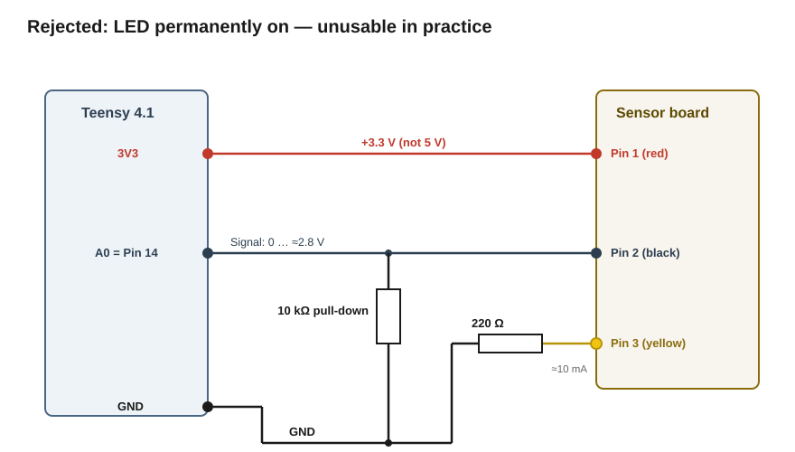
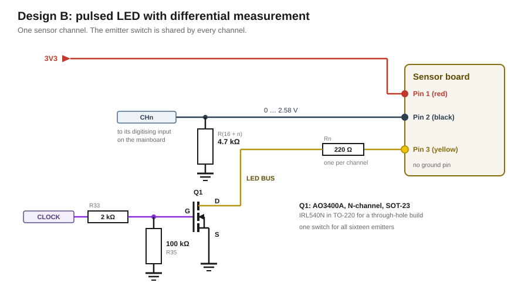
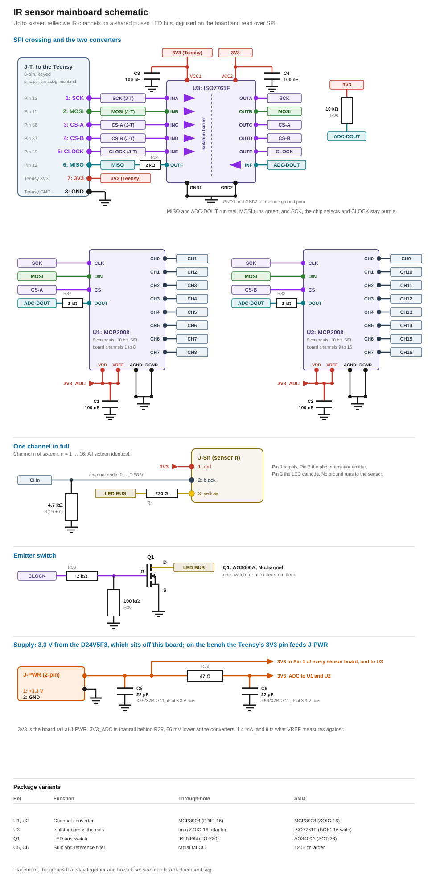

# IR ball sensing

Reflective IR channels detect the ball. Three sensor boards come out of the stock machine; It is planned to use 5 additional sensors in this modification. To simplify logic and programming those remaining five sensors boards are rebuilt as 1:1 copies of the original sensors boards. The Teensy 4.1 takes over the role the stock mainboard played — pulsing the emitters and evaluating the returns.

The stock board, its measurements and its reconstructed circuit are documented in [`research/Rokr/ir-reflective-sensor-p33.md`](../../research/Rokr/ir-reflective-sensor-p33.md). Everything below builds on the interface established there: 

- Pin 1 supply, 
- Pin 2 phototransistor emitter output, 
- Pin 3 IR LED cathode

There is no ground pin, and no current limit for the LED on the sensor aboard.

## Supply voltage: 3.3 V, not 5 V

The sensor boards run at 3.3 V. Pin 2 is an emitter fed from Pin 1 through the board's collector resistor, so its ceiling is the supply rail. The stock boards measure 1.585 kΩ there and the rebuilt ones carry 1.6 kΩ; every figure below is quoted at 1.585 kΩ and is unchanged by the difference at the precision given. At 3.3 V the output cannot reach a level the Teensy's non-5-V-tolerant inputs object to, and no divider or level shifter is needed. At 5 V it can, and every signal line would need one.

The 9 mm ball of this kit is more strongly curved than a standard pinball and throws less IR back to the sensor. Mounting distance and the pull-down value below account for that.

## Rejected: continuously lit LED

The simplest build needs no transistor: Pin 3 permanently to GND through 220 Ω, which gives ≈10 mA with no saturation voltage in the path, Pin 2 to an analog input through a 10 kΩ pull-down, and a fixed threshold on the static level. That pull-down puts the ceiling at 3.3 V × 10/(1.585 + 10) ≈ 2.85 V.



It was built and it works electrically. It is unusable anyway, because the phototransistor cannot tell where the IR came from. The analog input carries the sum of the board's own reflection and all ambient IR — daylight, lamps, light bounced off nearby objects.

| Objection | Evidence |
|---|---|
| Ambient movement swamps the signal | In the test build, small movements near the sensor shifted the level by several times what the 9 mm ball produces. A fixed threshold no longer separates ball from disturbance |
| Not calibratable | The baseline moves with time of day, room lighting and playfield surroundings. A threshold calibrated at build time is wrong an hour later, and direct sunlight can saturate the phototransistor outright |
| The stock machine does not do it either | It pulses at 333 Hz and subtracts, [as measured](../../research/Rokr/ir-reflective-sensor-p33.md) |

## Chosen circuit

One transistor switches the emitters of all eight sensors together, so a single Teensy pin controls the whole bus. Each phototransistor works into its own pull-down, and the Teensy samples that node on its own analog input — once with the emitters lit, once dark.



| Net | Wiring |
|---|---|
| Supply | Pin 1 of all eight boards to 3.3 V |
| Signal, 8× | Pin 2 of each board to its own analog input through a 1 kΩ in series, with a 4.7 kΩ pull-down to GND at the sensor-side node. The pull-down converts the photocurrent into a voltage; without it the output carries no measurable signal |
| LED drive, common | Pin 3 of each board through its own 220 Ω to a shared LED bus. The bus goes to the collector/drain of one switching transistor, emitter/source to GND, base/gate driven through a 1 kΩ from the clock pin, with a 100 kΩ pull-down to GND at the gate |
| Ground | No ground line runs to the sensor boards. The returns are Pin 2 through its pull-down and Pin 3 through its 220 Ω and the transistor |

### Computed results

Every figure here is derived in [the appendix](#appendix-derivations).

| Quantity | Value | Checked against | Margin |
|---|---|---|---|
| LED current per board | 10.0 mA nominal, **10.4 mA** at V_OUT max and V_F min | I_F absolute maximum 50 mA | **4.8×** |
| LED current, all eight | 83.3 mA worst case, **87.6 mA** with the photocurrent | regulator output 250 mA | **2.8×** |
| Phototransistor current | **0.54 mA** at V_OUT max | I_C absolute maximum 20 mA | **37×** |
| Dissipation in each 220 Ω | **24 mW** at 10.4 mA | ¼ W | **10×** |
| Gate drive out of the CLOCK pin | 3.3 mA peak for 39 µs | 4 mA per pin | **1.2×** |
| Dissipation in the regulator | 123 mW at V_OUT min | 400 mW | **3.3×** |
| Signal voltage at the ADC pins | 0 … **2.54 V** at V_OUT max | the 3.3 V pin limit | **0.76 V** |
| Phototransistor settling after one 300 µs phase | 75 % worst case, 99.9 % typical | — | accepted, see the appendix |
| Switching transistor Q1 | IRL540N, logic-level MOSFET, TO-220 | 36 A part switching 83 mA | chosen because it is on hand |

### Adjustment knobs

What a channel delivers is one number: the LED-on reading minus the LED-off reading. Without a ball it is small; a ball passing makes it jump, and the firmware compares that jump against a threshold.

Channels may carry different values, because the threshold is calibrated per channel at startup. Changing one channel's resistors moves only that channel's reading. What all eight share is the current they add up to on the LED bus.

Two things can go wrong with that number once a sensor is installed, and each is one resistor swap on that channel.

| What you see | Why | Change | Range before it breaks |
|---|---|---|---|
| One channel catches the ball sometimes and misses it sometimes, while its neighbours are reliable. The jump is there, but too small to threshold against | Too little IR comes back: that sensor sits further from the ball, at a worse angle, or over a duller patch of track | Make its emitter brighter — that channel's **220 Ω → 150 Ω**, raising it from 10.0 to 14.6 mA nominal, 15.3 mA worst case | 75 Ω … 448 Ω. Below 75 Ω on all eight, the regulator's 250 mA runs out; above 448 Ω the detector leaves the range the datasheet characterises |
| One channel sits near the top of its range all the time, ball or no ball, so a ball cannot push it any higher — it either never reports one or reports one permanently | Ambient IR alone already drives the phototransistor to its limit, leaving no headroom for the reflection | Make it less sensitive — that channel's **4.7 kΩ → 2.2 kΩ**. The same photocurrent then produces less voltage, so the range opens up again | 1 kΩ … 10 kΩ. Below 1 kΩ the jump is only 16 ADC steps and noise eats into it. Above 10 kΩ ambient light alone already delivers the maximum current, so no ball can be detected |

## Pin allocation

Which pins this subsystem takes, and what each one locks out, is in [`pin-assignment.md`](../../pin-assignment.md). What constrained the choice:

- **S1–S8 must be ADC-capable.** Within the analog-capable set the sensor-to-pin mapping is free and lives only in the code.
- **CLOCK needs no special function** — no PWM, no interrupt, no ADC. It is toggled in software, and it avoids the pin carrying the onboard LED.

## Software timing

The Teensy toggles the clock pin at roughly 300 µs per phase and reads all analog inputs in both phases. Evaluated per sensor is the difference, LED-on minus LED-off, which leaves only the board's own reflection. The detection threshold is calibrated per sensor at startup with a clear track.

The timing runs **non-blocking as a state machine**, no `delay`, so displays, RGB LEDs, solenoids and further sensors share the same main loop. One complete cycle over all eight sensors takes ≈ 600 µs, because all eight emitters pulse together. Eight `analogRead` calls fit inside one phase: ≈20 µs each at the Teensy 4 default of four averages, so 160 µs of the 300 µs. What the loop must not contain is anything that blocks for milliseconds.

**The stock machine bounds the sample rate.** It samples once every 3 ms and it detects the ball, so the ball dwells in the detection window for at least that long. At 600 µs per cycle this design samples five times in the same span. Losing a ball where the stock machine catches one would take a dwell **2.5× shorter** than the stock machine's — below two cycles per pass.

Ball speed alone should not reach that. Free rolling down the playfield is rather slow and a plunger launch probably only a few m/s, a factor of about three across the whole table.

Whether a given channel has enough margin is measured rather than computed. Computing it would need the ball's speed at that exact spot, which is unknown.

The firmware already evaluates every channel every 600 µs. Have it count how many cycles in a row a channel stayed above its threshold while the ball went past. Five or more is margin. One or two is marginal, and a badly timed pass is lost.

For a marginal channel the remedy is a shorter phase for all eight, since they share one clock, or moving that sensor closer to the track.

## IR sensor mainboard

The resistors and the transistor move onto a board of their own rather than being wired point-to-point. The eight channels are electrically the circuit above, and the board generates its own 3.3 V from the 5 V supply. Each sensor board plugs in with its three wires; a single cable runs to the Teensy.



### Channel

Three resistors per channel: 4.7 kΩ from the signal pin to GND, 220 Ω from the LED pin onto the shared LED bus, and 1 kΩ in series in the signal line to the Teensy.

The 1 kΩ caps what flows into a Teensy pin at 1.8 mA for the case where the mainboard is powered and the Teensy is not. This in total puts 5.7 kΩ in front of the ADC with the sensor dark, which sets the sample window in [`firmware/constraints.md`](../../../firmware/constraints.md).

All eight 220 Ω resistors meet in one wire, the LED bus. It ends at Q1, which ties it to GND whenever the CLOCK pin goes high, so a single transistor switches all eight emitters together. CLOCK reaches Q1's gate through 1 kΩ, and a 100 kΩ from that gate to GND holds Q1 off while the Teensy boots and its pins are not yet driving.

### Supply

Two variants for power supply are planned:

| Variant | Supply |
|---|---|
| **A** — production ready | Own LDO on the board, fed with 5 V from a central power distribution board |
| **B** — prototype, breadboard | 3V3 from the Teensy, no regulator, no J-PWR |

**NOTE: Variant B has no fault isolation.** A short on a sensor cable reaches the regulator inside the Teensy. In variant A the same short only pushes the local LDO into current limiting, and the Teensy carries on.

In normal operation variant B draws 87.6 mA from the Teensy's 3.3 V rail, against the 250 mA that rail offers.

Variant B will be superseded by variant A once the power distribution board exists.

Both variants carry a 22–47 µF electrolytic and a 100 nF ceramic, in **parallel** between 3.3 V and GND at the entry, leads short. Variant A adds 10 µF at the regulator's input and output, each with a 100 nF ceramic alongside. The ceramics sit adjacent to the regulator's pins, the electrolytics as short as the layout allows; the datasheet states no distance.

*Two alternatives were considered and dropped. A **solder bridge** between the two supplies has no use, since the variants never exist side by side. A **series resistor in the supply line** would be pointless, because any value that limits a short also drops most of the 3.3 V in normal operation.*


### Regulator

**HT7333-A**, TO-92 - [datasheet](../../datasheets/HT73xx-A-UMW.pdf).

The 5 V rail is shared with switching loads on other boards, each of which buffers its own inrush and clamps its own transients locally.

The 5 V rail can sag by 1.11 V before the 3.3 V output moves, the series Schottky's 0.40 V included. Below 4.70 V the datasheet stops characterising the part; it keeps regulating there and adds at most 8 mV of output error, 0.4 % on the LED current.

### Connections

**To the Teensy:** S1–S8 and CLOCK. Pin allocation is defined in [`pin-assignment.md`](../../pin-assignment.md).

GND depends on the power supply variant used. For **Variant A** GND is provided by 2-pin power connector. For **Variant B**, GND is provied by a Teensy pin. 

**To each sensor board:** three conductors, identically wired:

| Wire | Sensor pin | Function |
|---|---|---|
| red | 1 | 3.3 V to the sensor board |
| black | 2 | Signal from the sensor board — **not GND** |
| yellow | 3 | LED cathode, through 220 Ω onto the LED bus |

### One LED driver instead of eight

The stock machine, apparently, gives every channel its own LED driver transistor; this board shares one. That is one transistor and one Teensy pin instead of eight of each, and the signal path stays separate per channel either way.

All eight emitters therefore pulse together. Every sensor except P31 from the stock machine sits under the track facing upwards, and none of them is in another's field of view, so nothing is lost by pulsing them at once.

## Notes for PCB Building

- **Q1 becomes an AO3400A in SOT-23** ([datasheet](https://www.aosmd.com/res/datasheets/AO3400A.pdf)). Its R_DS(on) is specified at V_GS = 2.5 V, so 3.3 V drive is a datasheet condition instead of an extrapolation.
- **The regulator** stays the HT7333-A, in **SOT-89**. Its 400 mW rating is quoted for no named package and with no thermal resistance, so the version with a heat tab is the safest to use.
- **Check the µF capacitors.** A ceramic replacing an electrolytic loses capacitance under DC bias, and the regulator needs 10 µF *effective* at 3.3 V.

## Component list

Additional to the Teensy 4.1 and the sensor boards, grouped by type and sorted by value. Where the type designation depends on the package, both are named.

| Qty | Part | Through-hole | SMD | Use |
|---|---|---|---|---|
| 8 | Resistor 220 Ω | | | LED current limit, one per channel. Mandatory — the sensor board has none |
| 9 | Resistor 1 kΩ | | | Series protection in each signal line, and the gate resistor for Q1 |
| 8 | Resistor 4.7 kΩ | | | Signal pull-down, one per channel |
| 1 | Resistor 100 kΩ | | | Gate pull-down, holds Q1 off during boot |
| 3 | Ceramic 100 nF | | | **C2, C4** at the regulator input and output; **C6** at the 3.3 V entry |
| 1 | Aluminium electrolytic 10 µF, ≥ 10 V | | | **C1.** Regulator input. A ceramic substitute must still measure 10 µF at 3.3 V after DC-bias derating |
| 1 | Aluminium electrolytic 10 µF, ≥ 6.3 V | | | **C3.** Regulator output, per the datasheet's typical application. Part of the control loop, so a ceramic substitute must still measure 10 µF at 3.3 V |
| 1 | Aluminium electrolytic 22–47 µF, ≥ 6.3 V | | | **C5.** Bulk decoupling at the 3.3 V entry, both variants |
| 1 | Schottky diode | 1N5819, DO-41 | SS14, SMA | **D1.** Reverse polarity protection on the 5 V input |
| 1 | Logic-level MOSFET | IRL540N, TO-220 | AO3400A, SOT-23 | Shared LED switch **Q1**. An S8050, BC337 or 2N2222 substitutes for it — see the note under the derivations |
| 1 | LDO HT7333-A | TO-92 | SOT-89 | **U1.** 3.3 V from the 5 V supply (variant A only). Pin order 1 = GND, 2 = V_IN, 3 = V_OUT |

### Rebuilt sensor boards

Five of the eight sensors are rebuilt as copies of the stock board. The photointerrupter has no through-hole equivalent, so these are SMD.

| Qty | Part | Through-hole | SMD | Use |
|---|---|---|---|---|
| 5 | Reflective photointerrupter | — | GP2S700HCP | Emitter and detector. The stock part is presumed to be this type, see [`research/Rokr/ir-reflective-sensor-p33.md`](../../research/Rokr/ir-reflective-sensor-p33.md) |
| 5 | Resistor 1.6 kΩ | | | **R1**, collector load. The stock boards measure 1.585 kΩ, which is not a stock value; 1.6 kΩ moves the channel ceiling by 6 mV |

## Appendix: derivations

**Base quantities.** Everything below is built from these.

```
V_OUT     regulator output, ±3 %              3.201 … 3.399 V, 3.3 V nominal
V_F       LED forward voltage                 1.1 V   see the note under the 220 Ω
V_DS      drop across Q1, 83 mA × 0.1 Ω     ≈ 8 mV

U_R       across the 220 Ω, three cases:
          3.300 − 1.1 − 0.008                 = 2.192 V  nominal
          3.399 − 1.1 − 0.008                 = 2.291 V  most current: V_OUT max, V_F min
          3.201 − 1.4 − 0.008                 = 1.793 V  least current: V_OUT min, V_F max

I_LED     U_R / 220 Ω                          = 10.0 mA nominal
                                               = 10.4 mA worst case
                                               =  8.2 mA least
I_BUS     8 × I_LED worst case                 = 83.3 mA
I_C       V_OUT max / (1.585 + 4.7) kΩ         = 0.54 mA per channel
I_TOT     I_BUS + 8 × I_C                      = 87.6 mA  everything the regulator carries
```

V_DS is taken at the bus current it helps produce. The loop closes in one step because 8 mV is 0.4 % of U_R.

**220 Ω, LED series resistor.**

```
R_min = U_R most / 50 mA (I_F max)            ≈ 46 Ω   → 220 Ω is 4.8× above it
P     = I_LED worst² × 220 Ω                  ≈ 24 mW  → ¼ W is 10× that
```

V_F is 1.2 V typ and 1.4 V max at I_F = 20 mA per the datasheet, and lower at 10 mA; 1.1 V is the value the stock board's own diode-range reading supports. I_F absolute maximum is 50 mA, so the worst-case 10.4 mA sits 4.8× inside it.

R_min pairs the **lowest** plausible V_F with the **highest** regulator output: both push the current up, and the LED is what must survive it. At V_F = 1.4 V the same 46 Ω passes 43 mA, at 1.1 V it passes 50 mA.

The IRL540N specifies R_DS(on) at three gate voltages, all as maxima at I_D = 15–18 A: 0.044 Ω at 10 V, 0.053 Ω at 5.0 V, 0.063 Ω at 4.0 V. Nothing is given at 3.3 V, and the curve steepens as V_GS falls — the last volt costs as much as the previous five. **0.1 Ω is an estimate above the 4.0 V figure, not a reading.** It barely matters: the design would not notice 1 Ω, which drops 83 mV against U_R = 2.19 V. V_GS(th) is 1.0 V min and 2.0 V max, so 3.3 V turns the part on with 1.3 V over the worst-case threshold.

**HT7333-A, supply margin.**

```
Dropout at I_TOT      90 mV max at 40 mA, extrapolated   ≈ 197 mV  estimate
Output leaves 3.3 V   3.30 + 0.197 + 0.40 (Schottky)      = 3.89 V  at the rail
Characterised to      V_IN = 4.3 V                        = 4.70 V  at the rail
Dissipation           (4.60 − 3.201) V × I_TOT            = 123 mW
```

At twice the extrapolated dropout the rail could still sag 0.9 V, so the margin does not rest on the extrapolation.

**1 kΩ, series resistor in the signal line.**

```
Channel ceiling   V_OUT max × 4.7 / (1.585 + 4.7)     = 2.54 V
Unpowered pin     clamps at                          ≈ 0.7 V
Into the pin      (2.54 − 0.7) V / 1 kΩ              = 1.8 mA  per channel
Source impedance  sensor dark: 1 kΩ + 4.7 kΩ         = 5.7 kΩ
                  4.7 kΩ from the signal, 1 kΩ from the protection
```

**1 kΩ, gate resistor.** A MOSFET gate is a capacitor. No current flows through it while it is held on, but each switching edge has to charge it, and only this resistor limits that.

```
I_peak = 3.3 V / 1 kΩ                               = 3.3 mA  → inside the 4 mA figure
t      ≈ Q_g / (I_peak / 2) = 64 nC / 1.65 mA       ≈ 39 µs   = 13 % of a 300 µs phase
  with 100 Ω instead: 3.3 V / 100 Ω                 = 33 mA   → 8× the 4 mA figure
```

Q_g = 64 nC max, [IRL540N datasheet](http://www.redrok.com/MOSFET_IRL540N_100V_36A_44mO_Vth2.0_TO-220.pdf). The 39 µs edge costs nothing, because each channel is sampled at the end of its phase, by which time the LED has been at full current for 260 µs. V_GS(th) is 1–2 V max, so 3.3 V does turn the part on.

**4.7 kΩ, signal pull-down.** The phototransistor delivers a current; the pull-down turns it into the measured voltage, `U = I_photo · R`. Four requirements set the value, against the board's internal 1.585 kΩ:

```
Headroom          U_max = 3.399 V × 4.7 / (1.585 + 4.7)    ≈ 2.54 V  at V_OUT max
Resolution        50 µA × 4.7 kΩ = 0.235 V                 ≈ 73 steps of a 10-bit ADC
Ambient headroom  saturates at 3.201 V / 6.285 kΩ          ≈ 509 µA  at V_OUT min
                  at 10 kΩ instead                         ≈ 276 µA  → 4.7 kΩ has 1.8× the margin
Settling          t_r/t_f max 100 µs at R_L = 1 kΩ         → ≈ 470 µs at 4.7 kΩ (10–90 %)
                  τ = 470 µs / 2.2                         = 214 µs
                  after one 300 µs phase = 1.4 τ           → 75 % settled, worst case
                  typical part: 20 µs → 94 µs, τ = 43 µs   → 99.9 % settled
```

A smaller value is faster and more tolerant of ambient light, and less sensitive. Signal strength is the scarce quantity with the 9 mm ball, so 4.7 kΩ is the starting point.

**The 75 % is accepted, not fixed by a longer phase.** Settling and sample count pull against each other, and the amplitude loss is the cheaper one to pay: the startup calibration absorbs a constant factor, whereas a missed pass cannot be recovered.

| Phase | Cycle | Settled, worst case | Cycles per pass, 3 mm window at 2 m/s | 6 mm at 1 m/s |
|---|---|---|---|---|
| 300 µs | 0.6 ms | 75 % | 2.5 | 10 |
| 650 µs | 1.3 ms | 95 % | 1.2 | 4.6 |
| 1000 µs | 2.0 ms | 99 % | 0.75 | 3 |

**1 kΩ, base resistor of the LED transistor (NPN variant).**

```
I_B  = (3.3 − 0.7) V / 1 kΩ           = 2.6 mA
       Teensy recommended maximum       4 mA   → 2.6 mA fits, a smaller R would not
h_FE needed = 76.3 mA / 2.6 mA        ≈ 30    worst case, V_OUT max
       S8050 specifies 85 minimum             → over-driven by 2.8×
```

The gate needs a **100 kΩ pull-down to GND**, so the LEDs cannot switch on undefined while the Teensy boots with its pins still high-impedance.

**An NPN works as a substitution.** Same resistors in the same places — the 1 kΩ becomes the base resistor at I_B = 2.6 mA, the 100 kΩ still holds the base down during boot. The one difference is the saturation voltage: ≈0.2 V against the MOSFET's 8 mV, which drops the LED current from 10.0 to 9.1 mA per board. Either accept that 9 % — the per-channel calibration absorbs it — or fit **200 Ω** instead of 220 Ω to land back on 10.0 mA. The MOSFET is the documented build because it needs neither change.

**Why Pin 1 needs no external resistor.**

```
I_C,max = 3.399 V / (1.585 + 4.7) kΩ ≈ 0.54 mA  ≪ 20 mA (datasheet I_C maximum), V_OUT max
```

The board's internal 1.585 kΩ already limits the phototransistor branch. Only the LED path on Pin 3 has no limit on the board and needs one externally.

**Bounds on the adjustment knobs.** Each is the point at which the design stops being safe or stops working.

```
220 Ω  lower bounds take the largest U_R — V_OUT max, V_F min:
                             U_R = 3.399 − 1.1 − 0.008              = 2.291 V
        lower, one channel   R = 2.291 V / 50 mA (I_F max)          =  46 Ω
        lower, all eight     R = 2.291 V / ((250 − 4) mA / 8)       =  75 Ω
        the upper bound takes the smallest U_R — V_OUT min, V_F max:
                             U_R = 3.201 − 1.4 − 0.008              = 1.793 V
        upper                datasheet characterises I_C at I_F = 4 mA:
                             R = 1.793 V / 4 mA                     = 448 Ω

4.7 kΩ lower                 resolution at a 50 µA delta:
                             1 kΩ → 50 mV → 15.6 steps of 3.2 mV
        upper                not signal loss — see the table below.
                             ambient headroom halves and the reading
                             becomes drift-prone

1 kΩ   lower                R = 3.3 V / 4 mA                       = 825 Ω
gate    upper                t = Q_g × 2R / 3.3 V ≤ 100 µs
                             → R = 100 µs × 3.3 V / (2 × 64 nC)    = 2.6 kΩ

100 kΩ lower                 gate voltage = 3.3 V × R / (R + 1 kΩ)
                             must clear V_GS(th) max 2.0 V
                             1.5 kΩ → 1.98 V, too close; 10 kΩ → 3.00 V
        upper                gate leakage × R stays below the threshold:
                             100 nA × 1 MΩ = 100 mV

300 µs lower                 50 % settled at τ = 214 µs: 0.693 τ      = 148 µs
        upper                three cycles inside the 3 ms dwell
                             → cycle ≤ 1 ms → phase                  = 500 µs

1 nF   upper                 10 nF × 4.7 kΩ = 47 µs, 6× under the 300 µs phase
```

**The pull-down's upper bound is not signal loss.** The effective signal is `I × R × settling(R)` and keeps growing with R, because the settling loss goes as 1/R and the two cancel. What shrinks is the ambient headroom:

| R | settled after 300 µs | effective signal at 50 µA | ambient light that maxes the channel out |
|---|---|---|---|
| 1 kΩ | 100 % | 50 mV | 1238 µA |
| 2.2 kΩ | 95 % | 104 mV | 846 µA |
| **4.7 kΩ** | 75 % | 177 mV | 509 µA |
| 10 kΩ | 48 % | 241 mV | 276 µA |

The 100 nA gate leakage is the usual I_GSS specification for this class of MOSFET, not a figure read from the IRL540N datasheet. It only sets the upper bound of a value that is already an order of magnitude away, so the conclusion does not rest on it.

## Sources

- [`research/Rokr/ir-reflective-sensor-p33.md`](../../research/Rokr/ir-reflective-sensor-p33.md) — the stock board's circuit, the measured 1.585 kΩ, the 333 Hz pulsing and the ambient-light reasoning behind it
- [`research/teensy-4.1.md`](../../research/teensy-4.1.md) — the 3.3 V input limit and the 4 mA per-pin recommendation
- [Sharp GP2S700HCP datasheet](../../datasheets/IR-reflective-gp2s700hcp_e.pdf) — V_F, I_F and I_C maximums, t_r/t_f against load resistance, optimal sensing distance
- [Changjiang S8050 datasheet via LCSC](https://datasheet.lcsc.com/lcsc/Changjiang-Electronics-Tech-CJ-S8050_C2146.pdf) — minimum current gain
- [UMW HT73xx-A datasheet](../../datasheets/HT73xx-A-UMW.pdf) — UTD Semiconductor, Jul 2025. Section 8.4 for the 3.3 V version, the pinning table for the TO-92 order, section 9 for the capacitors
- [IRL540N datasheet](http://www.redrok.com/MOSFET_IRL540N_100V_36A_44mO_Vth2.0_TO-220.pdf) — gate threshold voltage and total gate charge
