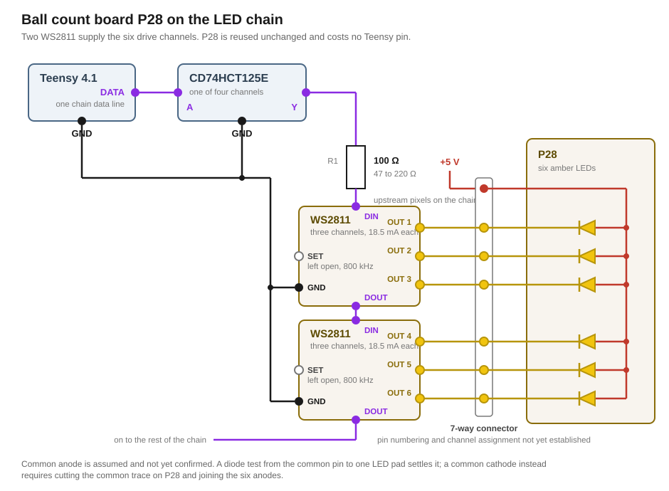

# Lighting

This section describes the design to be used for lightening this modeification and uses the documentation of the [`stock machine lighting`](../../research/Rokr/4_lighting.md).

## Stock Limitations

The stock machine uses a very primitve design for lighting, which brings a couple of limitations when it comes to modding: 

- Most playfield LEDs are sodered to the mainboards (P37 and P39) and therefore are not reusable at all. This applies to the score, drain and bumper LEDs.
- The ball track LED boards (the four arrows, P29 and P30) are dual color (red and white) but it is not possible to lit the four LEDs per board individually.
- The LED stripes are single color and do not allow effects beside turning the whole stripe on or off.
- The ball count board (P28) uses single color LEDs.

## Overview

## Features & Layout

The lightning positons of the stock machine is planned to be reused and augmented. 

Most if not all lights shall be full RGB. All lights shall individually adressable.

Planned to implement:
- **NEW** - Top rollover lanes
- **NEW** - Left and right side playfield 
- **NEW** - Diorama ceilling
- **NEW** - Playfield lights (at existing location) 
- *Reused* - Life points in shooter lane

Evaluating:
- Light under bells
- Light on ball lane entries
- Light inside crocodile
- Light under Slingshots
- Lights inside tunnel
- Light for rotating seal raget
- etc.


### LED Hardware
Considering the vision of this modification (in combination with the limitations above), every light is planned to be an addressable RGB device. The part is the **WS2812B**, which operates at 5 V and can be fed from the existing 5 V power supply.

> The only exception for this modification might be reusing P28 in the shooter lane. Reasons for that is that the PCB already fits in place and the LEDs can be lit individually, though mono-color only.

A 2 m long and 2.7 mm thin, cuttable WS2812B LED strip covers most if not all needs for this modification. It fits, even though barely, the stock plastic trenches of the playfield's side panels.

The sides and the diorama ceilling light already take 115.5 cm. Re-lighting the remaining stock lights takes approximately another 45 cm. This leaves nearly 40 cm over for custom lighting.

Whether or not to use discrete LEDs (such as [NeoPixel 5050](https://www.adafruit.com/product/1655)) is not yet decided. Larger package sizes are easy to handle but have limited use. The smaller star-shaped cutouts on piece E5 might only just fit a 2020 package size. Cutting and taping the LED strip, potentially wasting a couple of centimeters strip length, seems far more practial.

## Power Consumption

### Software

**Ball sensing and game logic have priority over lighting.** Since all code shares one main loop, special attention must be applied, so light code is not blocking other critical paths of the firmare. See the timing rules in [`firmware/constraints.md`](../../../firmware/constraints.md).

The game logic addresses lighting through **logical groups** and **named effects**. 

- A group can be physical (e.g., region on the playfield) or logical (e.g, track lights): 

- An effect is what a group is asked to do: on, off, flash, pulse, fade, or a named animation.

## Detailed Light Layout

Positions follow the stock inventory in [`research/Rokr/4_lighting.md`](../../research/Rokr/4_lighting.md), with the three stock strips replaced at 160 LEDs/m, 6.25 mm pitch.

**Devices** are what sits in a chain and what a frame has to clock out. **Lit** are the ones an effect may turn on. The two differ only on the perimeter, see [Perimeter: every second device](#perimeter-every-second-device-below-full-scale).

| Group | Devices | Lit | Function |
|---|---|---|---|
| Perimeter left | 79 | 40 | Ambient, along the playfield frame |
| Perimeter right | 79 | 40 | Ambient, along the playfield frame |
| Diorama ceiling | 26 | 26 | Ambient, overhead |
| Score | 10 | 10 | Score bar |
| Ball count | 6 | 6 | Balls remaining, on the reused P28 board |
| Track | 8 | 8 | Four tracks, two lights each |
| Bumper section | 4 | 4 | Three around the bumpers, one at the centre |
| Drain | 1 | 1 | |
| Top lane rollovers | not yet counted | not yet counted | Added by the modification, absent from the stock machine |
| **Total** | **213 plus rollovers** | **135 plus rollovers** | |

## Perimeter: every second device, below full scale

158 of the 213 devices sit in the two perimeter strips, and they carry ambient light rather than indication. Every second device is lit, giving 12.5 mm spacing against the strip's own 6.25 mm, and the group runs below full scale. The stock strips it replaces sit at 13.5 mm.

| Quantity | Effect of the decision |
|---|---|
| Lit-die current on the perimeter | Halved, from 9.5 A to 4.8 A with all three dies on |
| Frame time | **Unchanged.** A dark device still takes its 24 bits and passes the remainder along, so the longest chain stays 79 devices and 2.4 ms |
| Quiescent current | **Unchanged**, roughly 1 mA per device whether lit or dark, 0.21 A over all 213 |
| Chain topology, failure domains, pin count | Unchanged |
| Supply rating | **Unchanged.** The supply is sized for the enforced 2.0 A budget, not for the unconstrained maximum |

The dark devices stay fitted and stay addressable, so the spacing is a firmware constant. An effect that wants the full density has it.

Running below full scale keeps the 2.0 A limiter as a backstop. `setMaxPowerInVoltsAndMilliamps` scales **global** brightness, so a perimeter that regularly reaches the budget dims every other group with it, and a bumper flash then loses brightness because an ambient fade happened to be running at the same moment. A perimeter that leaves headroom means only unusual scenes reach the limiter.

## Chains follow failure domains

A chain is electrical rather than geometric and may wander anywhere on the board, so distributing lights across the playfield does not by itself require several chains.

What does require them is failure behaviour. Three solenoids shake the cabinet, and a single chain of 213 devices puts 212 joints in series where any one of them darkens everything after it. Each chain is therefore one failure domain, cut so that a fault stays local and points at where to look.

| Chain | Contents | Devices |
|---|---|---|
| 1 | Perimeter left | 79 |
| 2 | Perimeter right | 79 |
| 3 | Diorama ceiling | 26 |
| 4 | Lower playfield: score, drain, ball count | 17 |
| 5 | Mid playfield: track lights | 8 |
| 6 | Top playfield: bumper section, rollovers | 4 plus rollovers |

The three ambient strips stay separate for this reason alone. Together they hold 184 of the 213 devices and span the widest cable runs in the machine.

## Teensy pins

**Proposed, not yet entered in [`pin-assignment.md`](../../pin-assignment.md).**

| Pin | Chain | What it costs |
|---|---|---|
| 5 | 1 | I²S2 data input, and no audio input is planned |
| 6 | 2 | I²S1 data output alternative, and I²S1 is unused |
| 7 | 3 | Serial2 RX |
| 8 | 4 | Serial2 TX, I²S1 data input |
| 9 | 5 | I²S1 data output alternative |
| 10 | 6 | One of three SPI CS options, 36 and 37 remain |

The set costs one UART and no analog input. Nine of the eighteen analog inputs already serve the IR sensing, and SPI stays whole in case the display becomes a TFT.

PJRC's default set for Teensy 4.x is 2, 14, 7, 8, 6, 20, 21 and 5. Pin 2 carries I²S2 audio and pin 14 carries the IR channel S1, and pins 20 and 21 are analog. Teensy 4.x accepts any pin set, so the four remaining defaults are joined by 9 and 10 instead.

## Level shifting

The WS2812B data input threshold is specified against its own supply, so at 5 V it sits above the 3.3 V the Teensy can drive. The exact figure is an open point.

**Two CD74HCT125E**, four channels each, covering up to eight chains. The HCT input threshold accepts 3.3 V as a valid high and the output swings to 5 V.

| Connection | Requirement |
|---|---|
| VCC, pin 14 | 5 V. The part is specified from 4.5 to 5.5 V and has no 3.3 V operating range |
| Decoupling | 100 nF between pin 14 and pin 7, as close to the package as the layout allows |
| OE, pins 1, 4, 10, 13 | All to ground. OE is active low, and an open OE leaves the output in high impedance |
| Unused inputs | To ground. An open CMOS input oscillates and couples into the neighbouring channels in the same package |

At I_OH = 4 mA the datasheet guarantees V_OH ≥ 3.7 V, well above what a CMOS input behind 100 Ω asks for.

## Signal wiring

**Series resistor of 47 to 220 Ω in each data line**, at the driving end. PJRC fits 100 Ω on its own adaptor board.

**Data and ground run together over the whole length of every link**, from the shifter to the first device of a chain and from one strip to the next. A shared ground point at the supply is necessary and does not replace this. The return current of a fast edge follows the signal conductor, and without a ground beside it the return takes a detour whose loop area both radiates and receives. Three solenoids switching 0.68 A are the interferer that loop is built for, and the disturbance then arrives in the same instant as the bumper hit.

**The 5 V is injected separately at each strip** rather than passed along from the previous one. A link then carries signal current instead of operating current, and a contact going bad takes down one chain instead of the section behind it.

## Current ceiling

135 lit positions at three dies each and roughly 20 mA per die come to **8.1 A** with everything at full, a figure no effect ever displays. Quiescent draw sits on top of it and does not vary with colour: 213 devices at roughly 1 mA come to **0.21 A**, 11 % of the lighting budget before anything is lit.

**The ceiling is enforced in firmware and the supply is sized for the ceiling.** FastLED's `setMaxPowerInVoltsAndMilliamps` scales global brightness before every `show()` so that the sum stays within a set budget.

Budget: **2.0 A for lighting**. The stock machine stayed well below that, so the modification is brighter than the original while the supply stays modest.

```
LED budget, enforced in firmware      2.00 A
Three solenoids energised             2.04 A   measured
Audio at full output                  0.45 A   estimated
Teensy and logic                      0.15 A   estimated
                                      ------
Simultaneous total                    4.64 A
```

What the budget buys: quiescent draw takes 0.21 A, leaving 1.79 A across 135 lit positions, an average of **13 mA per position**. What that is worth depends on the base colour, since each die drawn costs its own 20 mA:

| Base colour | Per position | 13 mA is |
|---|---|---|
| Saturated, one die | 20 mA | 66 % |
| Mixed, two dies | 40 mA | 33 % |
| White, three dies | 60 mA | 22 % |

The saturated palette is what makes the budget comfortable. Ambient alone, the 80 perimeter positions plus the 26 in the ceiling, comes to 2.12 A on one die at full and therefore still runs below full scale.

**Supply: 5 V, 6 A.** Roughly 30 % headroom on the simultaneous case.

The firmware limit is load bearing. Without it the lighting alone draws 8.1 A, the supply enters current limiting, the rail sags and the Teensy resets, possibly with a solenoid energised. The supply is therefore chosen to limit current rather than to latch off.

## Ball count board P28

The stock P28 carries six amber LEDs, a 7-pin connector and nothing else. Its value is that it already fits: hole pattern, LED spacing and position in the wooden structure are all settled. The design keeps it untouched.



**Two WS2811 on the modification's own board** drive it. The WS2811 is the controller of a WS2812 sold on its own, with three constant-current channels and no LEDs, so it supplies exactly what P28 lacks. Three channels each gives six.

The chain's data line enters the first controller, passes to the second and continues into the rest of the chain. The six outputs run over the existing seven-way cable to the six LEDs, and the seventh wire carries the common connection to 5 V.

To the library the pair reads as two RGB pixels whose channels happen to be six separate amber LEDs. A helper hides that:

```cpp
void setBallLamp(uint8_t i, uint8_t brightness) {   // i = 0..5, from the top
  leds[BALL_LAMP_FIRST + i / 3][i % 3] = brightness;
}
```

Cost: no Teensy pin and six slots in the frame. The ball count gains per-device brightness, so a lost ball fades out and the bar can show intermediate states.

| WS2811 property | Value |
|---|---|
| Package | SOP8 or DIP8 |
| Supply | 4.5 to 5.5 V, absolute maximum 6.0 to 7.0 V |
| Output current per channel | 18.5 mA typical, fixed in the IC with no external setting |
| Output type | Sink, rated to 12 V, which is what makes the common anode necessary |
| SET pin | **Left open on both devices.** Open selects 800 kHz, tying it to VDD selects 400 kHz, and the rest of the chain runs at 800 kHz |


## Open points

| Point | What settles it |
|---|---|
| P28 common pin: anode or cathode | Diode test from the common pin to one LED pad, board disconnected. A cathode means cutting the common trace and joining the six anodes instead |
| P28 pin to LED position mapping | Note which LED glows during the same diode test |
| P28 connector type, pitch and pin numbering direction | Caliper and inspection |
| Rollover count | Count the added positions |
| WS2812B current per die, quiescent draw and input threshold V_IH | The strip's datasheet. The 20 mA per die and 1 mA quiescent used above are convention, and no V_IH figure is sourced yet. The copy in `docs/datasheets/` is a scan with no text layer |
| Whether WS2812B and SK6812 bit timings overlap enough for one waveform to drive both | The T0H, T1H and reset windows in the two datasheets. Only relevant if a mixed chain is ever wanted |
| Maximum current of the stock amber LEDs on P28 | Unmarked parts with no datasheet. Start below the WS2811 figure on the bench and raise it |
| Strip pitch, and with it every device count in this document | Caliper across ten devices on the strip. The 160 LEDs/m is the supplier's figure, not a measurement, and 213 devices, 2.4 ms and 8.1 A all follow from it |
| Perimeter brightness cap | Bench check on the assembled machine: the level at which the perimeter reads as ambient light and still leaves the indicator groups their share of the 2.0 A budget |

## Known limitations

**FastLED colour correction does not apply to the P28 pixels.** Correction and gamma scale each channel differently, which is right for red, green and blue dies and wrong for six identical amber LEDs, where it would make them unequally bright at the same value. Either global correction is disabled and applied per pixel instead, or P28 sits on a chain of its own.

**The firmware current limit is part of the power design.** It is recorded here rather than only in the firmware because the supply rating depends on it.


## Part List
https://amzn.eu/d/0jcgB8mw - SEZO WS2812B IC RGB LED Strip 2.7mm 2M 160LEDs/m


## Sources

- [Worldsemi WS2811 datasheet](../../datasheets/WS2811-Worldsemi.pdf): package options, pin functions, supply range, output current, SET pin, reset time
- [OctoWS2811](https://www.pjrc.com/teensy/td_libs_OctoWS2811.html): simultaneous DMA update of eight strips, default pin set for Teensy 4.x, free choice of pins, buffer chip and series resistor guidance
- [`OctoWS2811.h`](https://github.com/PaulStoffregen/OctoWS2811/blob/master/OctoWS2811.h): the `WS2811_GRB` byte order, and the single `config` and `numPerStrip` shared by all pins of an instance
- [TI CD74HCT125 datasheet](https://www.ti.com/lit/ds/symlink/cd74hct125.pdf), document SCHS415A: pin functions, 4.5 to 5.5 V supply range, active low OE, output voltage at 4 mA
- [`research/Rokr/4_lighting.md`](../../research/Rokr/4_lighting.md): stock LED inventory, strip lengths and pitch, housing dimensions, P28
- [`research/Rokr/1_power-supply.md`](../../research/Rokr/1_power-supply.md): measured solenoid current, stock load inventory
- [`research/teensy-4.1.md`](../../research/teensy-4.1.md): 3.3 V logic, per-pin current, analog input count
- [`firmware/constraints.md`](../../../firmware/constraints.md): the 3 ms budget the IR sensing imposes on the loop
