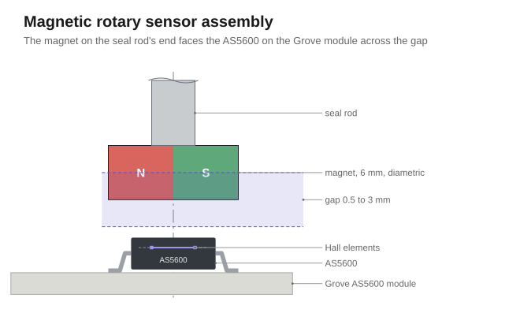
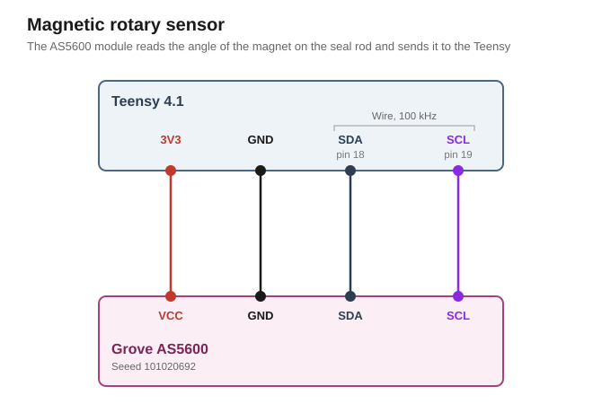

# Magnetic rotary sensor

The magnetic rotary sensor measures how far a magnet turns. A Seeed Grove AS5600 module, 101020692, faces a magnet on the rod's end and hands the rod's angle to the Teensy over I²C.

It detects the rotation of the seal on the rotating assembly in the middle of the playfield.

## Requirements

- The firmware reports that the seal moved, by how much and in which direction.
- The seal assembly keeps rotating as it does in the stock machine.

## Grove AS5600 rotary sensor

The Grove AS5600 is a small board from Seeed that carries the AS5600, a chip measuring the angle of a magnet turning in front of it. The Teensy reads the angle over I²C, at the AS5600's full resolution of 12 bits, 4096 steps to a turn. The module's direction switch stands on CW, so the count rises with a clockwise turn, seen from above. 

## Magnet and mount

A 6 mm disc magnet, magnetized across its diameter, is mounted to the end of the seal rod, centred on the rod's axis.

The AS5600 faces the magnet closely at 0.5 mm to 3 mm. The datasheet allows the axis 0.25 mm from the centre of the package for a magnet of that size. The AS5600 raises its gain for a weak field and lowers it for a strong one, and reports the setting as AGC. The gap is right when the AGC reports a value of roughly 64. The driver reads it at start-up.



[`magnet-model`](magnet-model/index.html) is an interactive, static webpage that computes the gap range and the angle error an off-centre axis causes for a magnet of any diameter, height and grade, and draws the side view.

## Circuit



### Signal

The module sits on `Wire`, the Teensy's first I²C port, with SDA on pin [18](../../pin-assignment.md "SDA to the rotary sensors") and SCL on pin [19](../../pin-assignment.md "SCL to the rotary sensors").

The bus runs at 100 kHz, the Standard-mode rate `Wire` starts with.

### Supply

VCC comes from the Teensy's 3V3.

## Firmware

The driver only collects the rod's angle as steps every 5 ms without waiting on the bus. It uses the start-up value as reference and adds signed steps to it. The result of that addition is reported to the event queue. To minimize jitter events are only published if the new position compared to the last reported value is at least 12 steps. 4096 steps are 360°. Once the rod has not moved that far for 20 ms, the driver publishes one event saying the rod stands still. [`firmware/magnetic-rotary.md`](../../../firmware/magnetic-rotary.md) describes the driver.

The sensor is further abstracted to the [rotating seal component](../../../firmware/components/rotating-seal.md). This component then provides the higher level functions a game can query and evaluate.

## Part list

| Qty | Part | Where |
|---|---|---|
| 1 | Seeed Grove AS5600 module, 101020692 | facing the rod's end |
| 1 | disc magnet, 6 mm, diametrically magnetized | in the cap on the rod's end |

## Appendix: derivations

Every figure below is recomputed by [`figures.py`](figures.py) from the inputs it names, and `tools/figcheck.py` compares each one against the line that states it.

### The bus

```
BUS       the module's pull-up, R4 and R5          4.7 kΩ
          each bus line, assumed                   200 pF
          the AS5600's low input level, of VDD   = 0.3
          and its high input level, of VDD       = 0.7
          a rising edge between the two, with
          the module's pull-up                   = 797 ns
          what Standard-mode allows                1000 ns
```

### The read

```
READ      the bus clock                            100 kHz
          one byte on the bus                      9 bits
          one read, the address and two bytes
          with START and STOP                    = 290 µs
          the tick that collects it                5 ms
          the share of the bus that takes        = 5.8 %
          a turn in                                4096 steps
          the fastest the rod may turn, half a
          turn per tick                          = 100 Hz
```

### The supply

```
SUPPLY    the Teensy's rail                        3.3 V
          the AS5600 in its 3.3 V mode, from       3.0 V
          up to                                    3.6 V
          its current, always on                   6.5 mA
```

## Sources

- [`datasheets/AS5600-ams.pdf`](../../datasheets/AS5600-ams.pdf): the supply modes and current, the input levels, the resolution, the magnet's displacement, and the pull-up it leaves to UM10204
- [`datasheets/Grove-AS5600-Seeed-schematic.pdf`](../../datasheets/Grove-AS5600-Seeed-schematic.pdf): the module's regulator, pull-ups, test points and DIR switch
- [Seeed wiki, Grove AS5600](https://wiki.seeedstudio.com/Grove-12-bit-Magnetic-Rotary-Position-Sensor-AS5600/): the module's supply voltage and the magnet's gap
- [`datasheets/UM10204-NXP.pdf`](../../datasheets/UM10204-NXP.pdf): the I²C specification, Rev. 7.0, with the Standard-mode rise time in Table 10
- [`research/teensy-4.1.md`](../../research/teensy-4.1.md): the pins are not 5 V tolerant
- [`pin-assignment.md`](../../pin-assignment.md): `Wire`
- [PJRC, `WireIMXRT.cpp`](https://github.com/PaulStoffregen/Wire/blob/master/WireIMXRT.cpp): the 100 kHz start
