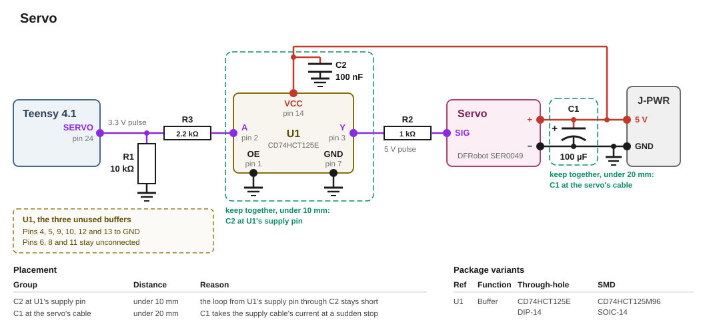

# Servo

This build uses a DFRobot SER0049 9 g micro servo with a clutch. It's planned as the driver for a ball-separating mechanism in the ball drain lane.

## Requirements

- The servo has two fixed end positions.
- The servo holds each of them.
- The servo moves only between them.
- The servo moves only on command.

## SER0049 Sservo Motor

The SER0049 runs from 4.8 V to 6 V. A pulse of 500 µs turns it to 0°, and a pulse of 2500 µs turns it to 180°. The full sweep varies by up to 10° from servo to servo. A clutch in its gears slips under force from the ball or a hand. After 5 s of blocking, the servo switches its motor off.

The sheet gives no restart for the motor after a protection cut. The servo has no feedback line. The firmware cannot see a protection cut.

The SER0049 has no end stop and turns all the way round by hand. The mechanism's stops keep the arm inside its travel. With the arm off the mechanism, the direction of the first move after power-up is unknown.

## End positions

The mechanism has two end positions. The angle of each is set once on the assembled machine. One end is the start position. At power-up, the servo stands at its last position. The driver's first move takes it to the start position in a fixed direction.

## Circuit



### Signal

The Teensy's pin [0](../../pin-assignment.md "Servo signal") drives the servo through the level shifter U1, which turns the 3.3 V pulse into a 5 V pulse. Because the SER0049's datasheet states no input level, a direct drive from the pin was rejected. U1 also protects the Teensy's pin against faults on the servo's cable.

R1 pulls the pin to ground through 10 kΩ. The servo thus gets no pulse from a floating pin. R3 with 2.2 kΩ between the Teensy and U1 protects the Teensy's pin with the machine off and the Teensy on USB. The pin then delivers at most 1.83 mA. R2 with 1 kΩ between U1 and the servo protects U1 against a signal wire shorted to 5 V or ground.

U1 has four buffers. The servo uses one of them. Its enable pin OE sits on ground. Its output is therefore always on. The other three buffers have their input and their enable pin on ground.

### Supply

The servo gets the machine's 5 V through J-PWR. U1 takes its 5 V and its ground at J-PWR. The servo draws up to 800 mA at each start and also when the motor is blocked. C1 with 100 µF at the start of the servo's cable absorbs the servo's steep current edges. At a sudden stop, the 5 V then rises by 43.9 mV at most. C2 with 100 nF at U1's supply pin delivers U1's short current peak at each edge of the pulse.

> On the bench, with the Teensy on USB, connect the Teensy's GND with the board's GND from the power supply.

## Teensy pins

| Signal | What the pin has to be |
|---|---|
| Servo signal | A PWM pin. PWMServo sets its timer to 50 Hz, and that holds for every pin on the timer. No other pin in use may sit on it. Pin [0](../../pin-assignment.md "Servo signal") shares its timer, FlexPWM1.1, only with pins 42 and 43, and the SD card holds both |

[`pin-assignment.md`](../../pin-assignment.md) lists what the pin costs elsewhere in the build.

## Firmware

The driver ensures that the servo cannot be operated outside of the predefined angles. [`docs/firmware/drivers/servo.md`](../../firmware/drivers/servo.md) describes the driver.

## Part list

| Qty | Part | Where |
|---|---|---|
| 1 | DFRobot SER0049, 9 g micro servo with clutch | on the ball separator |
| 1 | CD74HCT125E quad buffer, DIP-14 | U1, beside the Teensy |
| 1 | 10 kΩ resistor | R1, from the pin to GND |
| 1 | 1 kΩ resistor | R2, from U1's output to the servo's signal wire |
| 1 | 2.2 kΩ resistor | R3, from the pin to U1's input |
| 1 | 100 nF ceramic capacitor | C2, at U1's supply pin |
| 1 | 100 µF electrolytic capacitor, 10 V or more | C1, across the servo's supply at the start of its cable |
| 1 | reverse-proof 2-pin connector | J-PWR, 5 V and GND from the power distribution |

## Appendix: derivations

[`figures.py`](figures.py) recomputes every figure below from its inputs, and `tools/figcheck.py` checks each one against its line.

### Pulse

```
PULSE     the frame of the Arduino Servo library   20 ms
          its rate                               = 50 Hz
          the pulse for 0°                         500 µs
          the pulse for 180°                       2500 µs
          PWMServo's resolution of the frame       4096 steps
          one step of the pulse                  = 4.88 µs
          the servo's travel in steps            = 410 steps
```

### Signal levels

```
LEVELS    the Teensy's rail                        3.3 V
          its high output at 1 mA, at least      = 3.15 V
          U1's input current                       1 µA
          R3, from the pin to U1's input           2.2 kΩ
          that current across R3                 = 2.2 mV
          U1's high input threshold                2 V
          the margin of the high                 = 1.14 V
          the Teensy's low output at 1 mA, at
          most                                     0.15 V
          U1's low input threshold                 0.8 V
          the margin of the low                  = 0.64 V
          R1, from the pin to ground               10 kΩ
          the pin's current into R1, high        = 0.33 mA
          the pin's keeper after a reset, at its
          strongest                                105 kΩ
          U1's input against the keeper          = 0.299 V
          the unpowered pin, with U1's input
          current through R1                     = 10 mV
          the limit on an unpowered pin            0.31 V
          one wire of a cable with its two
          contacts, estimated                      0.1 Ω
          U1's ground over the distribution
          while the servo stalls                 = 80 mV
OFF       with the machine off, the pin's
          current through R3 into U1's clamp
          diode, at most                         = 1.5 mA
          the pin's whole current then           = 1.83 mA
          U1's clamp current, absolute maximum     20 mA
EDGE      U1's input capacitance                   10 pF
          the wiring at U1's input, estimated      15 pF
          the edge through R3 into both, from
          10 % to 90 %                           = 121 ns
          U1's longest input edge allowed          400 ns
```

### Output

```
OUTPUT    U1's supply, from                        4.5 V
          up to                                    5.5 V
          U1's high output at 20 µA, at its
          lowest supply, at least                  4.4 V
          R2, in the servo's signal wire           1 kΩ
          U1's output into a shorted signal
          wire, at its highest supply            = 5.5 mA
          U1's continuous output current,
          absolute maximum                         35 mA
```

### Supply

```
SUPPLY    the machine's rail, measured             5.0 V
          the servo, from                          4.8 V
          up to                                    6 V
          at rest, at most                         8 mA
          turning freely, at most                  120 mA
          stalled, in the sheet's selection table  650 mA
          and in its specification list            800 mA
          the feed from the distribution,
          estimated                                0.3 µH
          C1                                       100 µF
          its working voltage                      10 V
          the rise at C1 at a sudden stop        = 43.9 mV
          the rail during a coil's pull, at least  4.5 V
          the shortfall under the servo's floor  = 0.3 V
          C2, at U1's supply pin                   100 nF
```

## Sources

- [`datasheets/SER0049-DFRobot.pdf`](../../datasheets/SER0049-DFRobot.pdf): the supply range, the currents, the pulse range and the travel, the clutch and the protection. Its selection table and its specification list disagree on the no-load and the stall current
- [TI CD74HCT125](https://www.ti.com/lit/ds/symlink/cd74hct125.pdf), SCHS415A: the input levels, the input current, the clamp diodes and their current, the input capacitance and the longest input edge, the supply range, the output current and the output level, the capacitor at the supply pin, and the unused inputs
- [`datasheets/IMXRT1060CEC.pdf`](../../datasheets/IMXRT1060CEC.pdf), Rev. 4: Table 7, the ceiling on an unpowered pin; Table 22, the output levels and the keeper's resistance; Table 86, the keeper on the servo pin's pad at reset
- [Arduino Servo library, `Servo.h`](https://github.com/arduino-libraries/Servo/blob/master/src/Servo.h): the frame, `REFRESH_INTERVAL`
- [PJRC, Servo library](https://www.pjrc.com/teensy/td_libs_Servo.html): servo power straight from the supply, and the ground connection to the Teensy
- [PJRC, PWMServo](https://github.com/PaulStoffregen/PWMServo): the 50 Hz frame, the 12-bit pulse and the default pulse range
- [Adafruit, PCA9685 servo driver, Hooking it Up](https://learn.adafruit.com/16-channel-pwm-servo-driver/hooking-it-up): the starting capacitor per servo
- [`research/teensy-4.1.md`](../../research/teensy-4.1.md): the pins are not 5 V tolerant
- [`parts/solenoid/design.md`](../solenoid/design.md): the rail's floor during a coil's pull, the feed's inductance and the length of a pull
- [`pin-assignment.md`](../../pin-assignment.md): the servo's pin and its cost
