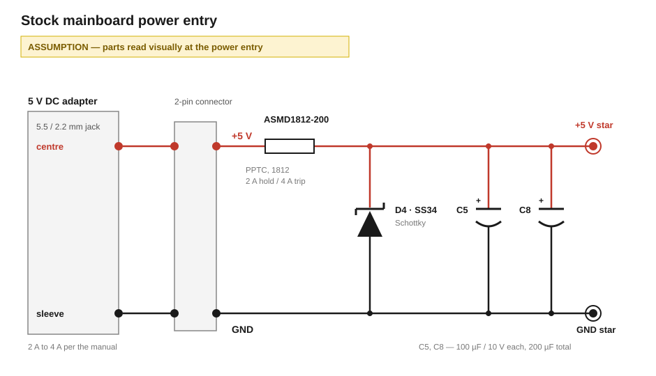

# Power Supply

The EG01 runs from an external 5 V DC adapter through a 5.5/2.2 mm barrel jack. Robotime's assembly instructions state the requirement as 5 V with 2 A - 4 A. No power supply ships with the product. 

The symptoms of an underpowered supply: no scoring from the ball sensors or arbitrary restarts.

## Loads

The stock machine requires the following loads:

| Load | Qty | Per unit | Total | Note |
|---|---|---|---|---|
| Bumper solenoid | 3 | 0.68 A while energized | 2.04 A | Measured in [`3_bumper-control.md`](3_bumper-control.md) |
| Single-colour LED position, warm white | ~111 | 10 mA estimated | 1.11 A | 83 strip positions plus 28 discrete, counted in [`4_lighting.md`](4_lighting.md) |
| Multicolour LED, bumper centre | 1 | ≤ 60 mA at full white | 0.06 A | Probably a WS2812B |
| IR reflective sensor channel | 3 | 10 mA average | 0.03 A | Measured in [`2_ir-reflective-sensor-p33.md`](2_ir-reflective-sensor-p33.md) |
| IR break-beam | 1 | ≤ 25 mA estimated | 0.03 A | Convention for a through-beam emitter and receiver |
| Speaker, 8 Ω | 1 | 0.45 A estimated | 0.45 A | Bridge-tied on the 5 V rail at full output, class-AB at 70 % efficiency |
| Controller and mainboard logic | 1 | 100 mA estimated | 0.10 A | MCU, audio amplifier quiescent draw and gate network on 5 V |
| **Total** | | | **1.78 A** | Everything lit and sounding; **3.82 A** with all three coils energized |

## Power Supply Circuit

A two-pin connector carries the jack onto the mainboard. The following parts sit near that connector.

| Seen | Assumed Reading |
|---|---|
| `C5`, `C8`, two radial electrolytics marked `100 10V VT`, mounted with opposite polarity orientation to one another | 100 µF / 10 V each, in parallel across the input, 200 µF total |
| `ASMD1812-200`, an 1812 SMD PPTC | Resettable overcurrent protection in the input feed |
| `D4`, an SMA package marked `MDD` `SS34` | MDD SS34 Schottky rectifier, shunt across the input |

### Power rails capacitors

The board contains two 100 µF / 10 V (200 µF in total) electrolytic capacitors at the power input, read as sitting in parallel across the 5 V rail.

Their most likely purpose is to carry the first microseconds of a load step while current through the barrel-jack cord is still rising, smooth the adapter's switching residue, and shunt the board's own switching noise to ground ahead of the cord. 200 µF is the conventional input bulk value for a 5 V board fed from a 2 A adapter.

### Circuit Protection

The board contains a resettable overcurrent fuse, `ASMD1812-200`, which is designed for 2 A normal operation and protects for currents over 4 A, matching the specification of the building manual.

### Reverse polarity protection

`D4` is an MDD SS34 Schottky rectifier, most likely shunted across the input with its cathode to plus. A reversed supply should therefore get shorted through it, and the current trips the PPTC.

## Sources

- [EG01 ROKR Pinball Machine assembly instruction, Robotime Community](https://community.robotime.com/t/eg01-rokr-pinball-machine-assembly-instruction/346): the 5 V / 2 A requirement and the symptoms listed for an underpowered supply
- [MDD SS34 Schottky barrier rectifier datasheet](https://www.lcsc.com/datasheet/C8678.pdf), Rev. 2024A5: reverse voltage, average rectified forward current, forward voltage
- [JDT Fuse ASMD1812 series datasheet](../../datasheets/ASMD1812-JDT.pdf): performance specification table, Tmao vs. Ihold table, parameter definitions
- [Class D Audio Amplifier Output Filter Optimization, Analog Devices](https://www.analog.com/en/resources/technical-articles/class-d-audio-amplifier-output-filter-optimization.html): inductor values for a bridge-tied 4 to 8 Ω output filter, and one inductor per leg in a balanced two-pole filter
