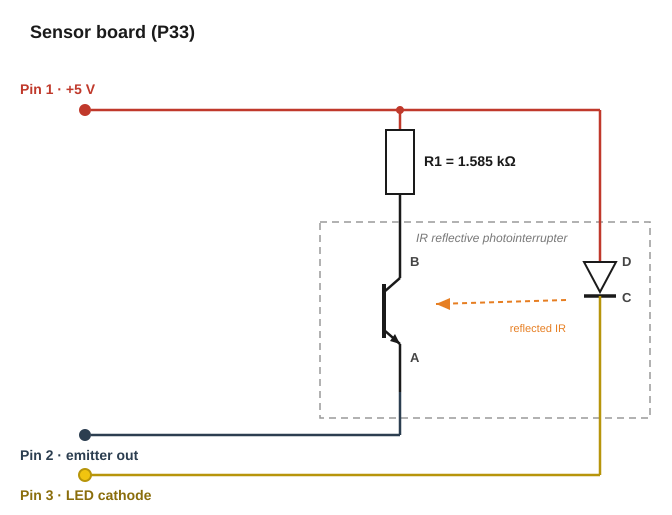
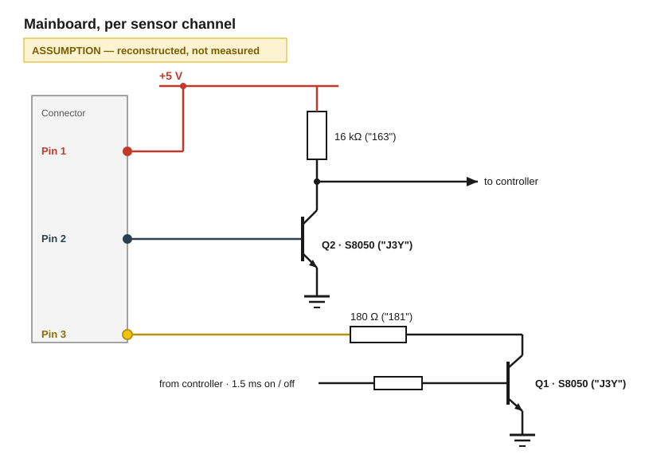

# Stock IR reflective sensor board (P33)

The stock ROKR EG01 senses the ball with three-wire boards such as the **P33**, carrying one reflective photointerrupter and one 1.585 kΩ resistor. Drive and evaluation sit on the mainboard.

The photointerrupter is consistent with a **Sharp GP2S700HCP** ([datasheet](../../datasheets/IR-reflective-gp2s700hcp_e.pdf)). The identification rests on package visuals and geometry as well as on the pad functions matching the datasheet's internal connection diagram pin for pin; the part number is not readable on the package.

## Sensor board

| Pin | Function | Same node as |
|---|---|---|
| 1 | +5 V in — feeds the IR LED anode and R1 | Pad D, R1 near end |
| 2 | Phototransistor emitter — output, and the photocurrent's return path | Pad A |
| 3 | IR LED cathode — return path, switched on the mainboard | Pad C |

R1 = 1.585 kΩ bridges Pin 1 and the phototransistor collector (Pad B) as the collector load.

- **No ground pin.** The LED current returns on Pin 3, the photocurrent on Pin 2.
- **No current-limiting resistor for the IR LED.** Pin 1 connects straight to the anode; the limit sits on the mainboard side of Pin 3.

### Pad naming

The four pads were labelled by position rather than by datasheet pin number, because the part's orientation on the board was unknown when the measurements were taken.

| Label | Position as viewed | Datasheet pin | Datasheet function | Function derived from the measurements |
|---|---|---|---|---|
| A | top left | 1 | Emitter | Emitter |
| B | bottom left | 2 | Collector | Collector |
| C | bottom right | 3 | Cathode | Cathode |
| D | top right | 4 | Anode | Anode |

All four agree. A 180° rotation would map A to the cathode and B to the anode, so the measurements also fix the orientation: the part sits as the datasheet's top view draws it.

`R1L` and `R1R` denote the left and right terminal of the resistor in the same view.

## What the readings show

Four near-zero readings group the points into nets:

| Net | Points on it | Evidence |
|---|---|---|
| Pin 1 | Pad D, R1's near terminal | `1 → D` and `1 → R1L` = 0.10 Ω |
| Pin 2 | Pad A | `2 → A` = 0.10 Ω |
| Pin 3 | Pad C | `3 → C` = 0.0 Ω |
| Collector | Pad B, R1's far terminal | `1 → B` and `1 → R1R` both = 1.585 kΩ |

That leaves three things to identify.

**The LED runs D → C.** `1 → 3` reads 1.082 V in the diode range one way and OL the other: a single junction, anode towards Pin 1. The same junction appears as `D → C` (1.077 V) and `1 → C` (1.078 V). An IR LED fits, since the datasheet's VF is 1.2 V at 20 mA and the meter's test current is far below that. In the resistance range the same path reads 12.5 MΩ, because the ohms source cannot forward-bias an LED.

**The phototransistor runs B (collector) → A (emitter), NPN.** `1 → 2` conducts at 6 k…35 kΩ and tracks illumination; `2 → 1` reads 46 M…OL. A light-controlled device that conducts only with its Pin 1 side positive has its collector on that side.

**R1 sits between Pin 1 and the collector.** `B → D` reads 1.365 V in *both* directions, which no junction does. It is the diode range's reading across 1.585 kΩ, implying a test current of 1.365 V ÷ 1585 Ω ≈ 0.86 mA — which fits the ≈1.08 V measured across the LED.

Two further readings follow from that layout. `B → C` = 2.066 V is R1 and the LED in series; their separate readings sum to 2.442 V, and the diode range falls short of it because its test current sags near the compliance voltage. Everything above a few MΩ — `3 → A/B/D/R1`, `2 → B`, `1 → C` — is reverse leakage at the meter's floor, which the datasheet permits up to 10 µA at VR = 6 V. An IR LED also acts as a photodiode, which is why some of those readings move with light.

## Measurements

- `X → Y` means the red lead on X, the black lead on Y.
- Several values separated by `…` are one measurement repeated under varying illumination of the sensor face, ordered **from fully lit to fully shielded**.
- `OL` is over-range / open (written `0L` in the raw notes). Combinations not listed read OL.
- `undefined` means the meter auto-ranged between kΩ and MΩ without settling.

### Diode range, connector pins

| Reading | Value |
|---|---|
| 1 → 3 | 1.082 V |
| all other combinations | OL |

### Resistance, connector pins

| Reading | Value |
|---|---|
| 1 → 2 | 6 k … 35 kΩ |
| 1 → 3 | 12.5 MΩ |
| 2 → 1 | 46 M … 60 M … OL |
| 2 → 3 | 46 M … 60 M … OL |

### Diode range, pad to pad

| Reading | Value |
|---|---|
| B → D | 1.365 V |
| B → C | 2.066 V |
| B → R1R | 1.365 V |
| B → R1L | 0.0 V |
| D → A | 3.3 … 1.5 … OL |
| D → B | 1.365 V |
| D → C | 1.077 V |
| D → R1R | 1.365 V |
| D → R1L | 0.0 V |

### Diode range, pin to pad

| Reading | Value |
|---|---|
| 1 → A | 1.5 … 3.3 … OL |
| 1 → B | 1.365 V |
| 1 → R1R | 1.365 V |
| 1 → C | 1.078 V |
| 1 → D | 0.0 V |
| 2 → A | 0.0 V |
| 3 → C | 0.0 V |

### Resistance, pin to pad

| Reading | Value |
|---|---|
| 1 → A | 2.4 k … 55 k … undefined |
| 1 → B | 1.585 kΩ |
| 1 → R1R | 1.585 kΩ |
| 1 → C | 18 M … 12 MΩ |
| 1 → D | 0.10 Ω |
| 1 → R1L | 0.10 Ω |
| 2 → A | 0.10 Ω |
| 2 → B | 0.7 M … 60 M … OL |
| 2 → R1L and R1R | 0.7 M … 60 M … OL |
| 2 → C | 17 M … 60 M … OL |
| 3 → A | 25 M … OL |
| 3 → B | 25 M … OL |
| 3 → D | 25 M … OL |
| 3 → R1L and R1R | 25 M … OL |
| 3 → C | 0.0 Ω |

### In operation

Taken on the fully assembled machine while it was running normally. The harness wires to the sensor were cut and the probes spliced into the cuts, so the sensor stayed connected to the mainboard and every trace includes the mainboard's loading. Scope ground went to the ground of the 5.5/2.2 mm DC input jack, so the levels below are absolute against the machine's system ground.

| Pin | Observation |
|---|---|
| 1 | 5 V, smooth. 10 mA — a current reading rather than a scope trace, and consistent with the average of the pulsed LED current rather than its peak |
| 2 | Near 0 V up to 0.6 V, roughly rectangular, corners rounded at top left and bottom right (bottom right more so). 1.5 ms per level. A closer object raises the amplitude, never above 0.6 V |
| 3 | Flat plateaus, no curve, between 3.5 V and 4 V, 1.5 ms each |
| 2 and 3 | Exactly inverted — Pin 2 HIGH coincides with Pin 3 LOW |

## Discrepancies in the record

Three internal contradictions, each resolvable. None of them changes the topology.

**R1's left and right terminal are swapped in one block.** In the pad-to-pad diode readings, the `B → R1L/R1R` and `D → R1L/R1R` rows are identical (0.0 V / 1.365 V). Both cannot hold: B and D sit at opposite ends of R1, so exactly one of them must read 0.0 V to R1L and the other 0.0 V to R1R. The pin-to-pad resistance block is self-consistent (`1 → R1L` = 0.10 Ω, `1 → R1R` = `1 → B` = 1.585 kΩ) and puts R1L on the Pin 1 / Pad D side. Under that labelling the `D` rows are right and the `B` rows have left and right swapped, which the raw record already flags as possible.

**The illumination order is reversed in one row.** `D → A` is recorded as 3.3 … 1.5 … OL and `1 → A` as 1.5 … 3.3 … OL. Pin 1 and Pad D are the same net, so these are the same measurement. More light lowers the phototransistor's collector-emitter resistance and therefore the diode range's displayed voltage, so the monotone order is 1.5 V lit → 3.3 V partly shaded → OL dark: the `1 → A` row is the correct one.

**Two illumination sweeps disagree in magnitude.** `1 → A` gives 2.4 k … 55 kΩ and `1 → 2` gives 6 k … 35 kΩ across the same net pair. Different ambient light between the two sessions; only the trend carries information.

## Mainboard

Nothing on the mainboard was probed with a meter. The circuit below is a reconstruction from the part markings and the oscilloscope traces.

Read from the packages: two NPN transistors marked **J3Y**, the SOT-23 marking for the S8050 ([marking index](https://www.alldatasheet.net/view_marking.jsp?Searchword=J3Y), [S8050 datasheet](https://datasheet.lcsc.com/lcsc/Changjiang-Electronics-Tech-CJ-S8050_C2146.pdf)), and two resistors marked `163` and `181`. Read as three-digit EIA codes those are 16 × 10³ = 16 kΩ and 18 × 10¹ = 180 Ω. Also present: three unidentified capacitors, MLCC in appearance, and one unidentified diode. No role is assigned to them.

The reconstruction has Q1 switching the LED cathode to ground through the 180 Ω resistor, and Q2 taking Pin 2 straight onto its base, with the 16 kΩ as its collector pull-up and the output inverted to a 0–5 V level for the controller.

### What the waveforms confirm

Three independent numbers follow from the reconstruction and match what was measured.

| Prediction | Arithmetic | Measured |
|---|---|---|
| Pin 2 has a hard ceiling near 0.6 V | Pin 2 sits on Q2's base-emitter junction, which clamps at one VBE | ≤ 0.6 V, flat, at every distance |
| Pin 3's LOW plateau is 5 V − VF | VF = 1.2 V typ → 3.8 V; the observed 3.5 V implies VF ≈ 1.5 V and I = (5 − 1.5 − 0.2) V ÷ 180 Ω = 18.3 mA | 3.5 V |
| Pin 1 draws roughly 10 mA average | LED at 50 % duty: 18.3…20 mA ÷ 2 = 9.2…10 mA. Phototransistor branch, saturated upper bound (5 − 0.6 − 0.2) V ÷ 1585 Ω = 2.65 mA, at 50 % duty ≤ 1.3 mA. Total 9.2…11.3 mA | 10 mA |

The flat ceiling on Pin 2 is the strongest of the three. A resistor to ground would give an output proportional to the photocurrent, rising to whatever R1 and that resistor divide the 5 V rail into — volts, not 0.6 V. A closer object raising the amplitude while never pushing past 0.6 V is what a forward-biased junction does, and it also means Q2's base is connected to Pin 2 with no series resistor. The rounded corners fit the same picture: the falling edge is the more rounded of the two, and the datasheet's Fig. 6 puts tf above tr across the whole plotted load range.

The LED current of 18–20 mA sits 2.5× inside the 50 mA absolute maximum, and the phototransistor's ≤ 2.65 mA well inside its 20 mA IC maximum.

### Timing

1.5 ms on plus 1.5 ms off is a 3.0 ms period — **333 Hz at 50 % duty**. Against tr/tf of 20 µs typ and 100 µs max, the sensor settles within a fifteenth of each half-period even at the worst-case figure, so 333 Hz is a mainboard choice rather than a sensor limit.

### Why Pin 3's HIGH plateau is ≈4 V and not 5 V

**Estimate, not a datasheet value.** With Q1 off, the only paths from the 5 V rail through the LED are the scope probe's input resistance and Q1's own off-state leakage — a few microamps between them. Datasheet Fig. 3 stops at 1 mA (≈1.0 V); extrapolating down two or three decades puts VF around 0.7–0.9 V, which places Pin 3 at 4.1–4.3 V against the ≈4 V observed.

The HIGH plateau is therefore set by leakage rather than by any circuit node, and it moves with whatever loads Pin 3. Loaded still more lightly, Pin 3 floats to essentially the full Pin 1 rail.

## Why the LED is pulsed

Inference, not documented by Robotime.

The detector is sensitive from 700 to 1200 nm and peaks at 930 nm, so daylight and incandescent lighting land squarely in its band, and the datasheet's design guide names external light as the main cause of false detection. The resistance readings show the size of the problem: with the IR LED completely unpowered, `1 → 2` moved from 6 kΩ to 35 kΩ on room light alone — an ambient response of the same order as the signal the sensor is meant to produce. A continuously lit LED gives the controller no way to separate the two. Pulsing does: every 3 ms there is a 1.5 ms window with the LED off, in which whatever the detector reports is ambient by definition.

The hardware only makes that possible. Q2 delivers a bare threshold decision with no analog subtraction, so comparing the two windows has to happen in firmware. Two cases are distinguishable there: a ball present shows up as a difference between the LED-on and LED-off windows, while ambient IR strong enough to push Pin 2 past Q2's threshold on its own saturates the output in *both* windows. The second case is detectable but not recoverable — the reading is lost until the light drops.

The rate follows from the same reasoning. A baseline is only worth subtracting if ambient has not moved between the two windows, and mains-driven lighting flickers at 100 or 120 Hz. At 333 Hz the windows sit 1.5 ms apart, roughly a sixth of a flicker cycle. At a tenth of the rate they would be more than a whole flicker cycle apart and the baseline would mean nothing.

## Sources

- [Sharp GP2S700HCP datasheet](../../datasheets/IR-reflective-gp2s700hcp_e.pdf) — Sheet No. D3-A02201EN. Ratings, characteristics, internal connection diagram, design guide
- Meter and oscilloscope readings on the stock machine
- [alldatasheet marking index for J3Y](https://www.alldatasheet.net/view_marking.jsp?Searchword=J3Y) and [Changjiang S8050 datasheet via LCSC](https://datasheet.lcsc.com/lcsc/Changjiang-Electronics-Tech-CJ-S8050_C2146.pdf) — J3Y as the SOT-23 marking for the S8050 NPN
