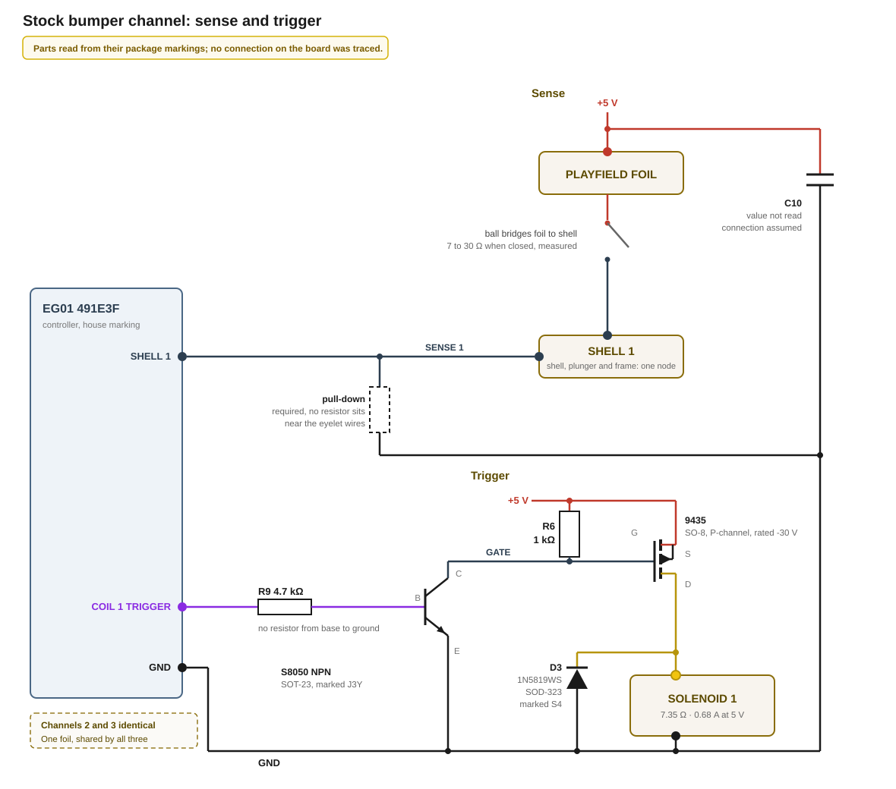

# Stock bumper mechanism and control

Three bumpers sit on the EG01 playfield. Each is an open-frame push/pull solenoid mounted through a playfield cutout, plunger upward, carrying a V-shaped metal shell above the playfield surface. Detection uses no separate sensor: the ball closes a contact between a conductive foil on the playfield and the shell.

## Bumper sensing

A conductive foil glued onto the playfield sits at 5 V whenever the machine runs (measured). Shell, plunger and frame form one conductive node; diode test and resistance from each coil pin to the frame read open, so this node is isolated from the coil.

A ball on the foil touching a shell connects that bumper's frame to 5 V. The conductive path reads 7–30 Ω, measured along the foil and across a closed contact, at various points. Each frame has its own wire to the mainboard, which is how the board tells the three bumpers apart.

## Trigger behaviour

One trigger produces one short pull-in. Manually forcing a permanent contact of a sensing eyelet and the foil eyelet does not keep the coil energized.
This is presumably done in order to protect the solenoid. Various other vendors include a warning in their datasheet that such a mini solenoid should not be driven longer than a couple of seconds. Whether hardware or firmware enforces the cut-off is not identified.

At power-on all three coils pull in once, together, and light and sound follow after; a restart after winning or losing a game does the same. Nothing triggers three bumpers at once, and a game ending is a software event that probably does not reset the controller, so firmware fires all three at the start of a game. The first one after power-on could also be the result of the controller pin sitting high during boot, which keeps the coil energized until firmware takes the pin low.

## Solenoid

| Property | Value |
|---|---|
| Supply | 5 V, measured in operation |
| Winding resistance | ≈ 7.35 Ω, measured |
| Coil current | ≈ 0.68 A, measured in series at the coil while running; 5.0 V ÷ 7.35 Ω gives the same, so the stock trigger path drops nothing measurable |
| Power while energized | ≈ 3.4 W — 5.0 V × 0.68 A |
| Stroke | ≈ 6 mm, measured installed with the shell mounted |

The manufacturer is unknown, probably some custom designed component.

## Wiring

Four eyelet-terminal wires and three 2-pin connectors leave the mainboard:

| Connection | Count | Attachment |
|---|---|---|
| Foil | 1 | eyelet terminal screwed onto the foil, white conductor |
| Frame sense | 3 | eyelet terminal on each solenoid frame |
| Coil | 3 | 2-pin connector per coil, red and black conductors |

A plain solenoid pulls in on either current direction, so the winding itself has no polarity. The distinction belongs to the trigger circuit.

## Mainboard

Nothing on the board was probed; parts were read visually.

The coil connectors and the four eyelet wires land in two separate areas of the board. This allows the guess which parts belong to which mechanism, though this is not evidence.

| Seen | Where | Reading |
|---|---|---|
| 3 × SO-8 marked `9435` | at the 2-pin coil connectors, closer to them than the J3Y | P-channel -30 V MOSFET |
| 3 × SOT-23 marked `J3Y` | same area, behind the 8-pin packages | maps to an S8050 NPN SOT-23 |
| 1 diode + 2 resistors per channel — `D3`, `R9`, `R6` on one channel | same area, at the coil pins | `D3` SOD-323 marked `S4` — a 1N5819WS, 40 V 1 A Schottky. `R9` marked `472` — 4.7 kΩ, `R6` marked `01B` — 1.00 kΩ |
| `C10` | at the four eyelet wires — foil and the three shells | type and value not read |
| 1 × controller marked `EG01 491E3F` | position not recorded | `EG01` is the kit's model number, so the package carries a house marking and the type is not identifiable from it |

### Trigger circuit

Based on the components on the board, the following circuit seems plausible: 

`9435` on an SO-8 is a P-channel MOSFET rated -30 V, a marking several makers share. A P-channel device conducts when its gate is pulled below its source, so the source sits on the 5 V rail, the drain on the coil, and the coil's other pin on ground.

The S8050 pulls the gate to ground, a resistor returns it to 5 V, and a high level at the controller pin energizes the coil. Which of `R9` and `R6` sits where was not traced. `R9` is most likely the base resistor, because 4.7 kΩ keeps the controller pin under 1 mA. `R6` is then the gate pull-up, and 1 kΩ fits there: it asks about 5 mA of the S8050, which the base current drives comfortably.

The base has no resistor to ground, so nothing but the controller pin sets it. On all three channels the coil is off only for as long as that pin does not go high.

`D3` is the flyback diode across the coil, cathode on the drain. Its 40 V stands against a 5 V rail, and its 1 A average rating against the 0.68 A the coil hands it at switch-off.

### Sense circuit

`C10` sits at the four eyelet-ended wires. The foil is the largest conductor in the machine and works as an antenna in both directions. It picks up noise from around it, and it radiates what the board puts on it. The capacitor therefore presumably sits on the foil's 5 V feed, where it passes the 5 V and shorts high-frequency noise to ground.

No resistor sits close to the eyelet wires. While no ball touches a bumper shell, that shell's sense line is open: nothing sets its voltage, and it picks up whatever noise is nearby. Thus, somewhere else a pull-down resistor to ground must exist. Otherwise, the controller would read noise as a closed contact and would fire the bumper. 

## Sources

- Meter and in-operation measurements on the stock machine — winding resistance, coil-to-frame isolation, closed-contact resistance, foil potential, supply voltage, stroke
- Observation on the stock machine — all three coils pull in once, together, ahead of light and sound, both when the supply is connected and on a restart that keeps it connected
- [BL Galaxy Electrical S8050 datasheet](../../datasheets/S8050.PDF) — document BL/SSSTC079 Rev. A: J3Y marking (ordering information), maximum ratings
- [Vishay Siliconix Si9435BDY, P-Channel 30-V (D-S) MOSFET](https://www.vishay.com/docs/72245/si9435bd.pdf) — document number 72245 Rev. D: channel type and drain-source voltage
- [1N5819WS SOD-323 Schottky barrier rectifier](https://mm.digikey.com/Volume0/opasdata/d220001/medias/docus/6778/5399_1N5819WS%20SOD-323.PDF) — reverse voltage, average rectified forward current, forward voltage; corroborated against [QEC 1N5817WS–1N5819WS](https://www.qec.com.tw/upload/tempupload/DataSheet_file/1N5817WS-1N5819WS(SOD-323)QEC.pdf)
- [EIA-96 resistor code table](https://www.hobby-hour.com/electronics/eia96-smd-resistors.php) — `01B` resolves as index 01 (100) × 10
