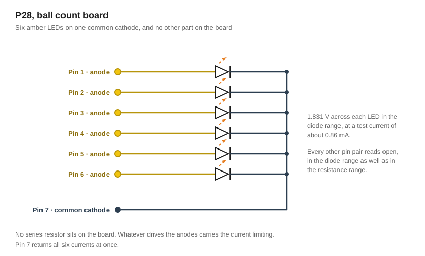
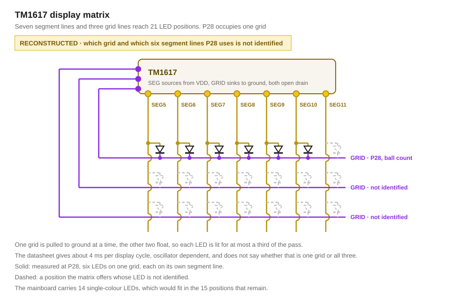

# Lighting

The following light sources exist in the stock machine

## Discrete LEDs

| Board | Qty | Colour | Function |
|---|---|---|---|
| Mainboards P37, P39 | 10 | Red | Score |
| Mainboards P37, P39 | 3 | Orange | Bumper section |
| Mainboards P37, P39 | 1 | RGB | Bumper pulse light |
| Mainboards P37, P39 | 1 | Blue | Drain |
| P28 | 6 | Amber | Ball count |
| P29, P30 | 4 + 4 | Red, white | Track lighting, one pair per track |
| **Total** | **29** | | **28 single-colour, 1 RGB** |

All LEDs are mounted directly on PCBs. The package appearance of the RGB LED is consistent with a WS2812B.

## LED strips

Three flexible strips ship with the stock machine, 2.5 mm wide and 0.9 mm high, each with a 2-pin connection. The LED colour is a yellowish white.

| Length | Pitch | LEDs on strip |
|---|---|---|
| 495 mm | 13.5 mm | ≈ 36 |
| 495 mm | 13.5 mm | ≈ 36 |
| 165 mm | 13.5 mm | ≈ 12 |
| **Total** | | **≈ 83** |

*The LED count is calculated from length and pitch, not counted.*

### Housings

The short strip is mounted in the ceiling of the diorama with double-sided tape.

The two long strips run left and right around the playfield, threaded into a trench in clear plastic housings so that the LEDs face the playfield. The trench follows the playfield's framing and measures 3.15 mm deep by 1.7 mm wide. LED strips are directed under the playfield to connect the plasic housings.

## Circuit

*Note: P28 was probed with a meter. Everything else here was read visually.*

### Connector pattern

| Connector | LEDs | Independently switched groups | Pins |
|---|---|---|---|
| P28 | 6 | 6, one per LED | 7 |
| P29, P30 | 4 | 2, one per colour | 3 |

On P29 and P30 the two LEDs of a colour sit in parallel on one line and can only be lit together. Each board carries two tracks, so the stock machine switches track lighting by colour and not by track. The pair also shares one series resistor, which divides the channel current between them according to their forward voltages rather than equally.

### Driver stage

Many LEDs, especially those on P29 and P30, are driven by the same circuit layout on the mainboard:

| Position | Marking | Value |
|---|---|---|
| Resistor | `01B` | 1.00 kΩ, 1 %., probably as the base resistor |
| Switch | `J3Y` | S8050 NPN in SOT-23 ([datasheet](../../datasheets/S8050.PDF)) |
| Resistor | `unknown` | - |

> [!WARNING]
> **TODO: re-read the series resistor's marking.**

> [!WARNING]
> **TODO: Measure board P29**

### Ball count board (P28)

*The building instruction calls this board "Score board", which imo does not fit its use.*

On the board there are six amber LEDs, a 7-pin connector and no other components. Current limiting and switching both sit off the board.

**Pin 7 is the common cathode, pins 1 to 6 are the six anodes.** Each of pins 1 to 6 reads 1.831 V in the diode range against pin 7 and blocks in the other direction, and every remaining combination reads OL in the diode range as well as in the resistance range. The six LEDs therefore share one node, and it is the one the meter's negative lead sits on. The connector carries six segment lines and one grid line, which is how a common-cathode display is wired: the six can be set individually, and they light only while their own grid is selected. The same 1.831 V appears across a single LED's own two pads, where the meter's test current also lights it.

**The six LEDs are multiplexed.** On the running machine with all six lit, a DC voltmeter across one LED reads 2.7 V to 3.8 V with the cathode positive, the value depending on which LED is probed. Reversing the leads reproduces the sign. A lit LED whose average sits in reverse is switched rather than driven continuously.

The LEDs apparently blink too fast for a voltmeter, so it most likely shows the average. Always on would read +1.8 V, never on would read −5.212 V. One LED reads −2.7 V, which is 36 % of the way between the two, so it is on **36 %** of the time.

Three grids at full brightness spend 33 % and fit. Two grids spend 50 % and are excluded, unless the brightness control dims at the same time.

### LED Display driver

The mainboard carries a **TM1617**, a Titan Micro LED display driver ([translated datasheet](../../datasheets/TM1617-TitanMicro.md)). The driver supports two mutually exclusive modes:
- **Mode 1:** 2 grids of 8 segments, up to 16 LEDs
- **Mode 2:** 3 grids of 7 segments, up to 21 LEDs

Which mode the stock machine uses is unknown. The on-time bound measured at P28 fits the three-digit mode at full brightness and rules out the two-digit one, unless the brightness control dims as well.

P28 is the most likely load. No group of six discrete driver stages was found on the mainboard for the ball count board, and the segment current is set inside the IC, 20 to 60 mA at VO = VDD − 3 V, which accounts for the absence of a series resistor anywhere in that path.

The TM1617 drives common-cathode displays. Its segment outputs source current from VDD and its grid outputs sink it to ground, so current runs out of a segment line, through the LED and into a grid line. That puts the anodes on the segment side and the cathodes on the grid side, one grid per digit.

P28's common pin measures as the cathode of all six LEDs, which is the polarity the TM1617 drives.

## Sources

- Visual reading of the mainboard, P28, P29 and P30: part markings, connector pin counts, LED placement
- Meter readings on P28: diode range and resistance range over every pin pair out of circuit, across one LED's own pads, and DC volts across one LED on the running machine
- [BL Galaxy Electrical S8050 datasheet](../../datasheets/S8050.PDF), document BL/SSSTC079 Rev. A: J3Y in the ordering information
- [EIA-96 resistor code table](https://www.hobby-hour.com/electronics/eia96-smd-resistors.php): `01B` resolves as index 01 (100) × 10
- [Titan Micro TM1617](../../datasheets/TM1617-TitanMicro.md), document V1.2, translated from the Chinese original: pin functions, drive polarity, display modes, segment and grid currents
