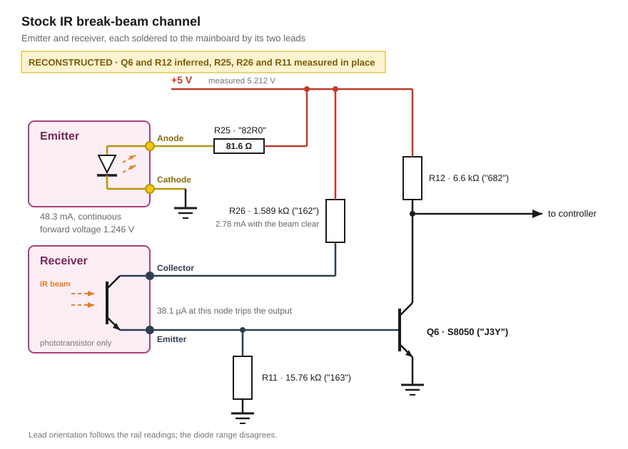

# Stock IR break-beam sensor

The stock machine carries one through-beam pair at the ball drain, each part soldered to the mainboard by its two leads, with drive and evaluation next to them.

## Beam pair

The emitter is one IR LED between its two solder points, reading 1.054 V in the diode range. In operation 1.246 V was measured.

The receiver is one phototransistor between its two solder points. The conducting direction reads 0.9 kΩ lit to 2.1 kΩ shaded, and the other direction blocks.

## Mainboard

Read from the packages and measured in circuit:

| | Marking | Code | Value | In circuit |
|---|---|---|---|---|
| R25 | `82R0` | four characters, `R` marks the decimal point | 82.0 Ω | 81.6 Ω |
| R26 | `162` | three-digit EIA, 16 × 10² | 1.6 kΩ | 1.589 kΩ |
| R12 | `682` | three-digit EIA, 68 × 10² | 6.8 kΩ | 6.6 kΩ |
| R11 | `163` | three-digit EIA, 16 × 10³ | 16 kΩ | 15.76 kΩ |
| Q6 | `J3Y` | SOT-23 marking of the S8050 | NPN | |

All four resistors read within 3 % of their marking, so nothing of comparable size sits in parallel with any of them.

### The emitter runs continuously at 48.3 mA

R25 is the only part between the rail and the LED, and no switching transistor sits on the emitter side.

Three readings on the running machine confirm the continuous drive. The rail stands at 5.212 V, R25 drops 3.942 V and the emitter drops 1.246 V. The two drops sum to 5.188 V, 24 mV short of the rail, so nothing else sits in the loop. A switching transistor would take about 0.2 V of that, and a 50 % duty cycle would halve both readings and land their sum near 2.6 V.

The current follows from the drop across R25:

3.942 V ÷ 81.6 Ω = **48.3 mA**, continuous.

### Receiver channel

Four readings against the mainboard's power connector, machine unpowered and the positive lead on the receiver lead, place the two receiver leads:

| Reading | Value | What it places |
|---|---|---|
| Collector lead to +5 V | 1.588 kΩ | R26, the collector load |
| Collector lead to ground | 13 MΩ | Nothing else reaches that node |
| Sense lead to ground | 10 kΩ | R11, in parallel with a junction |
| Sense lead to +5 V | 2 MΩ | No load on that node |

R11 reads 15.76 kΩ across its own ends and 10 kΩ from the sense lead to ground. The difference is 15.76 kΩ in parallel with 27 kΩ, and the 27 kΩ is Q6's base-emitter junction, which the meter's test voltage partly turns on with the positive lead on the sense node. Reversing the leads on that one reading confirms it, since the reverse-biased junction then leaves R11's own 15.76 kΩ.

Q6 and R12 stay a reconstruction, taken from the part values and the board layout. R12 = 6.6 kΩ pulls up Q6's collector. Q6 inverts the sense node to a 0 V to 5 V level for the controller.

Q6's base clamps the sense node at one VBE, so the photocurrent that trips the output is 0.6 V ÷ 15.76 kΩ = 38.1 µA.

With the beam unblocked and the phototransistor saturated, the receiver draws (5.212 V − 0.6 V − 0.2 V) ÷ 1.589 kΩ = 2.78 mA, continuous.

### Rail current

Emitter 48.3 mA plus receiver 2.78 mA gives 51 mA, budgeted as 0.05 A in [`1_power-supply.md`](1_power-supply.md).

## Measurements

- Values separated by `…` are one measurement repeated under varying illumination, ordered **from fully lit to fully shielded**.
- `OL` is over-range / open (written `0L` in the raw notes).

### In operation

| Reading | Value |
|---|---|
| Rail, at the mainboard's power connector | 5.212 V |
| Across R25 | 3.942 V |
| Across the emitter's two solder points | 1.246 V |

### Emitter

| Range | Reading |
|---|---|
| Diode | 1.054 V one direction, 0.311 V the other |
| Resistance | does not settle, 50 kΩ … OL. Polarity not recorded |

### Receiver

| Range | Conducting direction | Blocking direction |
|---|---|---|
| Diode | 1.6 V … 1.9 V | OL |
| Resistance | 0.9 kΩ … 2.1 kΩ | OL |

The two receiver sweeps disagree in magnitude: at 0.86 mA the lit 0.9 kΩ would read 0.77 V rather than 1.6 V. Different ambient light between the sweeps, so only the trend carries.

### Which lead carries the collector is contradicted

The rail-referenced readings put the collector on the lead that reaches R26. The diode range puts it on the other one, the lead that conducts with the positive test lead on it. A phototransistor conducts with its collector positive.

The two sessions named the leads independently and the leads carry no designation, so a swapped label is the likely cause. One reading settles it without moving the part: diode range, positive lead on the lead that reads 1.588 kΩ to the rail. Conduction at 1.6 to 1.9 V confirms the swap. A block in that direction instead means the phototransistor sits reversed in the channel, and then the collector load feeds its emitter.

### The emitter's blocking direction is unexplained

A bare LED reads OL against the meter's reverse bias, and this one reads 0.311 V while the resistance range refuses to settle. Two candidates stand, and neither is confirmed:

- The LED's own photovoltaic response. Ambient light drives an EMF the ohmmeter cannot separate from its own test voltage, and the displayed resistance then moves with the light.
- A second element across the two solder points. 0.311 V at 0.86 mA works out to 362 Ω.

Repeating the diode and resistance readings in both polarities with the LED covered separates them, since the photovoltaic response collapses in the dark. Nothing in the reconstruction above rests on the answer. A 362 Ω element would shunt ≈ 3.4 mA around the LED.

## Sources

- Meter readings on the stock machine
- [`2_ir-reflective-sensor-p33.md`](2_ir-reflective-sensor-p33.md): the meter's diode-range test current
- [BL Galaxy Electrical S8050 datasheet](../../datasheets/S8050.PDF), document BL/SSSTC079 Rev. A: J3Y in the ordering information, VBE(sat), VCE(sat)
