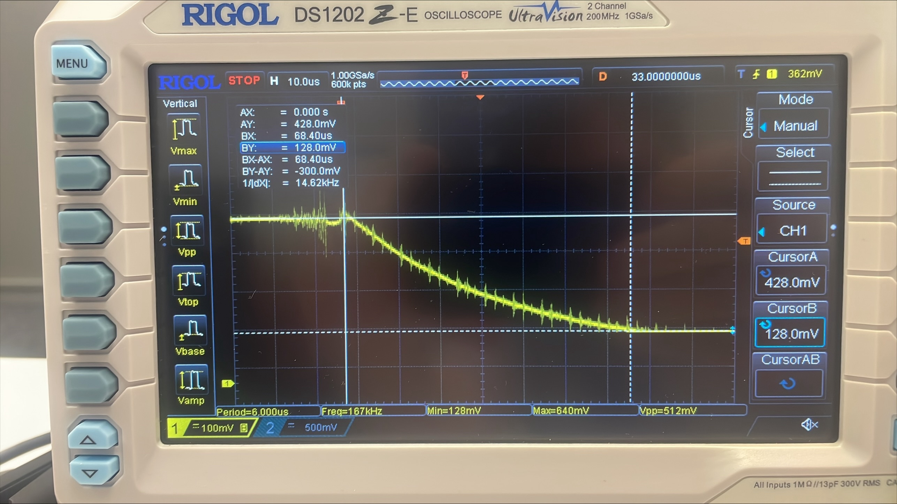

# CNY70

Notes on the reflective optical sensor held for a bench trial against the [GP2S700HCP](../Rokr/2_ir-reflective-sensor-p33.md) the stock sensor boards carry.

Figures are quoted from Vishay's [datasheet](../../datasheets/CNY70-Vishay.pdf), document 83751, Rev. 1.8.

## Specifications

| Property | Value | Condition |
|---|---|---|
| Package | leaded, 7 x 7 x 6 mm | |
| Emitter wavelength | 950 nm in the feature list, 940 nm peak in the characteristics table | λ_p at I_F = 100 mA |
| Daylight blocking filter | integrated | |
| Peak operating distance | under 0.5 mm, and 0 mm in the product summary | maximum CTR_rel |
| Operating range | 0 mm to 5 mm | relative I_out above 20 % |

### Absolute maximum ratings, T_amb = 25 °C

| Parameter | Symbol | Value |
|---|---|---|
| Total power dissipation, coupler | P_tot | 200 mW |
| Ambient temperature range | T_amb | −40 to +85 °C |
| Emitter reverse voltage | V_R | 5 V |
| Emitter forward current | I_F | 50 mA |
| Emitter surge current, t_p ≤ 10 µs | I_FSM | 3 A |
| Emitter power dissipation | P_V | 100 mW |
| Detector collector-emitter voltage | V_CEO | 32 V |
| Detector emitter-collector voltage | V_ECO | 7 V |
| Detector collector current | I_C | 50 mA |
| Detector power dissipation | P_V | 100 mW |
| Junction temperature, either side | T_j | 100 °C |

### Basic characteristics, T_amb = 25 °C

| Parameter | Symbol | Min. | Typ. | Max. | Condition |
|---|---|---|---|---|---|
| Collector current | I_C | 0.3 mA | 1.0 mA | | V_CE = 5 V, I_F = 20 mA, d = 0.3 mm, Kodak neutral test card, white side, 90 % diffuse reflectance |
| Crosstalk current | I_CX | | | 600 nA | V_CE = 5 V, I_F = 20 mA, no reflecting medium |
| Collector-emitter saturation voltage | V_CEsat | | | 0.3 V | I_F = 20 mA, I_C = 0.1 mA, d = 0.3 mm |
| Forward voltage | V_F | | 1.25 V | 1.6 V | I_F = 50 mA |
| Radiant intensity | I_e | | 7.5 mW/sr | | I_F = 50 mA, t_p = 20 ms |
| Virtual source diameter | d | | 1.2 mm | | 63 % encircled energy |
| Collector dark current | I_CEO | | | 200 nA | V_CE = 20 V, I_F = 0, E = 0 lx |

Eleven figures accompany the table: power dissipation against ambient temperature, the test condition, forward current against forward voltage, relative CTR against ambient temperature, collector current against forward current and against collector-emitter voltage, CTR against forward current and against collector-emitter voltage, collector current against distance, and two of relative collector current against angular and lateral displacement.

## What separates it from the GP2S700HCP

| | GP2S700HCP, Sharp D3-A02201EN | CNY70, Vishay 83751 |
|---|---|---|
| Package | SMD, the footprint the stock boards carry | leaded, 7 x 7 x 6 mm |
| Peak detecting distance | 3 mm | under 0.5 mm, above 20 % of peak out to 5 mm |
| Collector current | 60 µA min, 410 µA max | 0.3 mA min, 1.0 mA typ |
| the condition it is given at | I_F = 4 mA, V_CE = 2 V, aluminium evaporation on glass at 4 mm | I_F = 20 mA, V_CE = 5 V, white card at 0.3 mm |
| Rise and fall time | 20 µs typ, 100 µs max at R_L = 1 kΩ, V_CE = 2 V, I_C = 100 µA, d = 4 mm, with Figure 6 plotting it against load resistance | none published |
| Forward voltage | 1.2 V typ, 1.4 V max at I_F = 20 mA | 1.25 V typ, 1.6 V max at I_F = 50 mA |
| Forward current maximum | 50 mA | 50 mA |
| Collector current maximum | 20 mA | 50 mA |
| Saturation voltage | none published | 0.3 V max |
| Collector dark current | 1 nA typ, 100 nA max at V_CE = 20 V | 200 nA at V_CE = 20 V |

**The two collector-current figures do not compare.** Forward current, collector voltage, reflector material and distance all differ between the conditions, and the CNY70 sheet publishes no curve that carries a reading from one condition to the other. Which part returns more from a 9 mm steel ball at the working distance the playfield imposes comes off the bench.

**Vishay publishes no switching figure of any kind for the CNY70.** No rise time, no fall time, no curve against load resistance. The settling models in the [channel model](../../parts/ir-reflective/channel-model/) that rest on Sharp's Figure 6 therefore have no counterpart here, and every τ for this part starts from a measurement. Two shapes carry that measurement to other pull-downs and bracket the answer: τ proportional to the load, which is the first-order relation a load resistance against a fixed capacitance gives, and τ flat, which is what the measurement alone states.

## The collector load

**The collector is not brought out, so the 1.585 kΩ cannot be a measuring resistor.** The board's three pins are the supply, the emitter and the LED cathode, and R1 bridges the supply and the collector, which reaches nothing outside the board. Both are meter readings on the stock board: `1 → B` and `1 → R1L` at 1.585 kΩ, `2 → A` at 0.10 Ω.

**What it does bound is the current the device can pass.** A phototransistor under strong infrared saturates, and Sharp publishes no V_CE(sat) for the GP2S700HCP, so nothing in the sheet bounds the branch once that happens. R1 bounds it at (5 − 0.6) V / 1585 Ω = 2.8 mA against the 20 mA I_C maximum, taking the 0.6 V that Pin 2 was measured to clamp at. Whatever is wired to Pin 2 is inside that bound as well.

The 0.6 V clamp is a scope reading, flat at every distance, so a base-emitter junction on the mainboard holds Pin 2 there. The mainboard itself was never probed: its circuit is [a reconstruction](../Rokr/2_ir-reflective-sensor-p33.md) from part markings and scope traces, one of its four resistors is unread, and whether a resistor sits at Pin 2 beside that junction is open. The clamp holds either way, so the bound above does not rest on it.

**This modification puts a pull-down at that node**, which bounds the current at 3.449 V / 4.7 kΩ = 734 µA on its own. The rebuilt boards therefore carry no R1, and nothing in the CNY70's ratings asks for one.

```
saturation current, the whole external limit, at V_OUT max
  I_sat = V_OUT max / (R_col + R_pd)
        = 3.449 V / (1.58 + 4.7) kΩ                    = 549 µA →  1.1 % of the 50 mA I_C maximum
  with the collector at the rail
        = 3.449 V / 4.7 kΩ                             = 734 µA →  1.5 % of it
detector dissipation, worst case at half the rail, at V_OUT max
  P = V_OUT max² / (4 (R_col + R_pd))                  = 474 µW → 0.47 % of the 100 mW P_V
  with the collector at the rail                       = 633 µW → 0.63 % of it
```

What the resistor costs is range. The reading is ratiometric, so the divider's share of full scale is the node ceiling in converter steps whatever the rail does, and the rail enters only through V_CEsat, which is the largest share of it at V_OUT min:

```
ceiling = 1024 · R_pd / (R_col + R_pd) · (1 − V_CEsat / V_OUT min), V_OUT min = 3.146 V
  R_pd 4.7 kΩ, R_col 1.58 kΩ                           = 693 steps
  R_pd 2.2 kΩ, R_col 1.58 kΩ                           = 539 steps
  R_pd 1.5 kΩ, R_col 1.58 kΩ                           = 451 steps
  R_pd 4.7 kΩ, collector at the rail                   = 926 steps
```

A trial takes the collector to the rail and keeps the full 926 steps, which is what lets a measurement find the top of the part's range instead of the divider's.

## Readings off the curves

Taken off the plotted curves in document 83751, which prints no table for either. A reading between two decades of a logarithmic axis carries perhaps 0.05 V or 10 % of the value.

| Figure | Reading |
|---|---|
| Figure 3, forward current against forward voltage | V_F ≈ 0.95 V at 1 mA, 1.08 V at 10 mA, 1.22 V at 100 mA |
| Figure 5, collector current against forward current | the line is close to proportional over the plotted range, so half the 20 mA test current returns roughly half the 1.0 mA typical, about 0.45 mA at 10 mA |
| Figure 6, collector current against collector-emitter voltage | flat above about 1 V of V_CE at every forward current plotted, with the knee under 0.5 V |

## V_F, measured

2.19 V across a 220 Ω from Pin 3 to ground at a supply read as 3.37 V, LED lit continuously, collector taken straight to Pin 1 without the stock board's 1.585 kΩ. That is 9.95 mA and **V_F = 1.18 V at 10 mA**.

Figure 3 reads 1.08 V there, so the part sits 0.10 V above its own curve. Half of that is the reading error the figure carries on a logarithmic axis, the rest is ordinary spread between samples. A GP2S700HCP measured on the same bench at the same current gave 1.17 V, within 10 mV of the CNY70.

**A full board of CNY70 emitters costs about 2 mA more on the bus.** At 220 Ω from the rail maximum, the measured V_F of 1.18 V gives (3.449 − 1.15) V / 220 Ω = 10.4 mA per channel against the 10.3 mA the design derives for the GP2S700HCP, taking 2 mV/°C off V_F for the 40 °C the sensors are bounded at. Sixteen of them spend 167 mA of the 222.6 mA the emitters are allowed.

**V_CE stays in the flat part of Figure 6.** At 50 µA through 1.58 kΩ and 4.7 kΩ the device keeps 3.3 − 0.31 = 2.99 V, and Figure 6 is flat from about 1 V upward.

## Settling, measured

Free on the bench facing the ceiling, supply **3.37 V**, 220 Ω in the emitter line, **4.7 kΩ** pull-down, collector straight to the rail, falling edge. The supply and the pull-down are this design's, not a datasheet condition.

| | |
|---|---|
| Amplitude | 428 mV down to 128 mV |
| τ | about 20 µs |



## Ball signal, measured

Sighted through a bore **5 mm across and 3.9 mm deep**, the playfield's own thickness, with the ball sitting on the hole. **100 Ω** in the emitter line, **4.7 kΩ** pull-down, collector at the rail, otherwise the arrangement measurement B uses.

| | clear track | ball |
|---|---|---|
| LED on | 140 mV | 860 mV |
| LED off | 3 mV | 0.3 mV |

The signal is **722.7 mV**, 153.8 µA through the 4.7 kΩ. A GP2S700HCP at the same emitter resistor and pull-down returned 171.9 mV, so through that hole the CNY70 gives **4.2× the signal**. Its 860 mV sits well inside the rail its collector hangs on, where a GP2S700HCP meets the 2.47 V ceiling of its 1.585 kΩ collector load.

The 20 µs were taken at 91 µA of collector current, the 428 mV across the 4.7 kΩ. An installed GP2S700HCP returns 23 µA, and behind a bore the CNY70 would sit at some tens of microamps as well. A phototransistor gets faster the more current it carries, so installed it settles more slowly than 20 µs, and by how much nobody has measured. Its 128 mV dark reading comes from the same brightness and does not compare with the 2.1 mV of the stock board.

The ball signal above is unaffected, that one went through a real bore.

## What the bench has to settle

- The photocurrent a 9 mm steel ball returns and what a clear track returns, both at the working distance the install location imposes, emitter lit and dark.
- τ, from a reading taken settled against one taken at the read instant, at the pull-down fitted.
- Whether the 7 x 7 x 6 mm body fits the three install locations the stock boards occupy.
